This user manual provides a comprehensive overview of the Nano 33 BLE Sense board, highlighting its hardware and software elements. With it, you will learn how to set up, configure and use all the main features of the Nano 33 BLE Sense board.

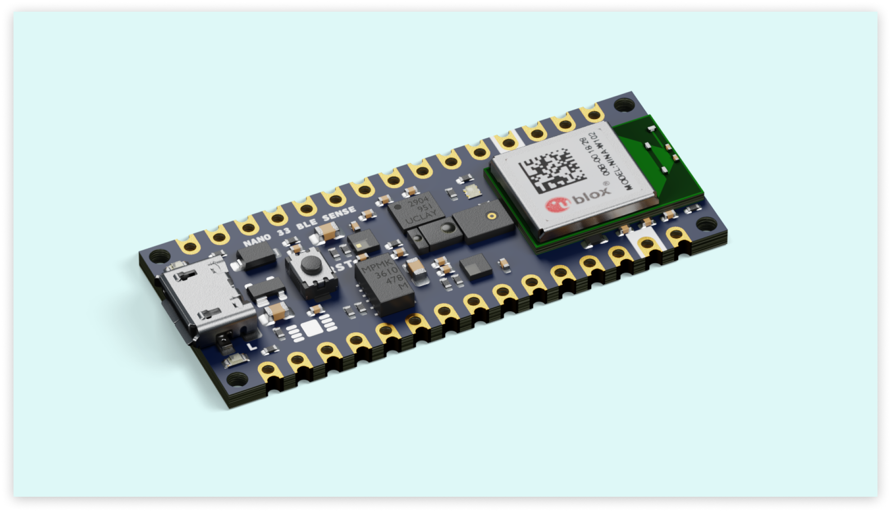

## Hardware and Software Requirements

### Hardware Requirements

- Nano 33 BLE Sense (x1)
- [USB Micro cable (x1)](https://store-usa.arduino.cc/products/usb-2-0-cable-type-a-micro)
- [Breadboard (x1) (recommended)](https://store.arduino.cc/products/breadboard-400-contacts)
- [Male/male jumper wires (recommended)](https://store.arduino.cc/products/10-jumper-wires-150mm-male?queryID=undefined)

### Software Requirements

- [Arduino IDE 2.0+](https://www.arduino.cc/en/software/), [OpenMV IDE](https://docs.arduino.cc/tutorials/nano-33-ble-sense/cheat-sheet/#imu) or [Arduino Web Editor](https://create.arduino.cc/editor)
- [Arduino Mbed OS Nano Board Package](https://github.com/arduino/ArduinoCore-mbed).


## Nano 33 BLE Sense Overview


The Arduino Nano 33 BLE Sense represents a significant leap in the Nano family, integrating the powerful Nordic nRF52480 microcontroller with an Arm® Cortex®-M4F core and a comprehensive suite of embedded sensors into the classic, compact form factor. This board is designed to bridge the gap between simple prototyping and advanced IoT development, providing the computational power and connectivity essential for modern applications.

The Nano 33 BLE Sense is built around the NINA-B306 module, featuring Bluetooth® 5 with long-range support and Thread/Zigbee capability. Its defining characteristic is the integrated sensor hub: a 9-axis IMU, humidity, temperature, barometric pressure, gesture, proximity, color, light, and microphone. Coupled with a dedicated cryptographic chip (ATECC608A) for secure communication, it offers an unparalleled out-of-the-box experience for data fusion and AI edge processing. Its miniature size (approx. 45 x 18 mm) and robust feature set make the Nano 33 BLE Sense the ideal choice for projects demanding sophisticated sensing, wireless connectivity, and the security of a modern microcontroller platform.

### Nano 33 BLE Sense Architecture Overview

The Arduino Nano 33 BLE Sense features a robust and certified design, purpose-built for a new generation of intelligent applications, including motion-activated devices, environmental monitoring, gesture control, and secure, low-power IoT edge nodes.

The top view of the Nano 33 BLE Sense board is shown in the image below:

The bottom view of the Nano 33 BLE Sense board is shown in the image below:

Here is an overview of the board's main components shown in the images above:

- Microcontroller: The heart of the NINA-B306 module is the Nordic Semiconductor nRF52480 microcontroller, based on a 64 MHz Arm® Cortex®-M4F processor with a floating-point unit (FPU). It provides 1 MB of Flash memory and 256 KB of SRAM for application development. Important: The board operates at 3.3V, and its I/O pins are not 5V tolerant.

- Micro-USB connector: The board uses a Micro-B USB connector for programming, power supply, and serial communication with a computer or other host device.

- Onboard user LED: The board includes an onboard user-programmable RGB LED to provide visual feedback.

- Power LED: A green power indicator LED (LED_PWR) illuminates when the board is powered.
  
- Integrated Sensor Hub: A defining feature of this board is its comprehensive suite of onboard sensors, including a 9-axis IMU ([LSM9DS1](https://www.st.com/resource/en/datasheet/lsm9ds1.pdf)), a humidity and temperature sensor ([HTS221](https://www.st.com/resource/en/datasheet/lsm9ds1.pdf)), a barometric pressure sensor ([LPS22HB](https://www.st.com/resource/en/datasheet/lps22hb.pdf)), a digital microphone ([MP34DT05](https://www.st.com/resource/en/datasheet/mp34dt05-a.pdf)), and a gesture, proximity, color, and light sensor ([APDS-9960](https://content.arduino.cc/assets/Nano_BLE_Sense_av02-4191en_ds_apds-9960.pdf)).

- Castellated Pins: The board's castellated pins allow for surface mounting as a module, facilitating direct integration into custom PCB designs and final products without the need for headers.

- Cryptographic co-processor: The board includes a Microchip ATECC608A secure element, which provides hardware-based secure storage for up to 16 keys, certificates, or data. This enables robust security for IoT applications, supporting ECDH key agreement and AES-128 encryption.

- Wireless communication: The board features Bluetooth® 5 connectivity through the NINA-B306 module, supporting features like 2 Mbps throughput, long-range mode, and advertising extensions. The module also includes an IEEE 802.15.4 radio.

### Board Core and Libraries

The **Arduino Mbed OS Nano Boards** core contains the libraries and examples to work with the Arduino Nano 33 BLE Sense's peripherals and onboard components, such as its nRF52480 microcontroller, advanced wireless capabilities, and the extensive suite of integrated sensors. To install the core for the Nano 33 BLE Sense board, navigate to **Tools > Board > Boards Manager** or click the Boards Manager icon in the left tab of the IDE. In the Boards Manager tab, search for Nano 33 BLE and install the latest Arduino Mbed OS Nano Boards package.

The Arduino Mbed OS Nano Boards core provides support for the following:

- Board control and configuration (reset, pin configuration, and low-power management)

- Wireless communication (Bluetooth® Low Energy)

- Advanced peripheral functions (12-bit ADC, PWM)

- Communication interfaces (UART, I2C, SPI)

- Onboard sensor hub access (IMU, microphone, humidity, pressure, gesture, color, light)

- Cryptographic functions (Secure hardware-based key storage with the ATECC608A)

- Standard Arduino libraries compatibility

### Pinout
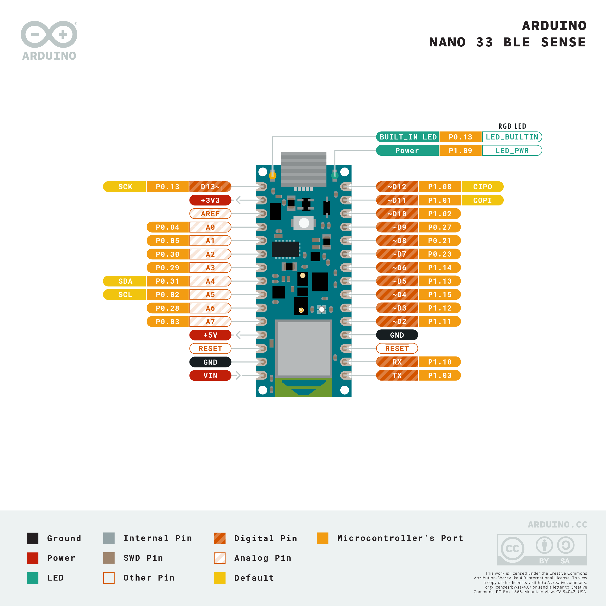

The full pinout is available and downloadable as PDF from the link below:
- [Nano 33 BLE Sense pinout](https://docs.arduino.cc/resources/pinouts/ABX00031-full-pinout.pdf)

### Datasheet
The complete datasheet is available and downloadable as PDF from the link below:
- [Nano 33 BLE Sense datasheet](https://docs.arduino.cc/resources/datasheets/ABX00031-datasheet.pdf)

### Schematics
The complete schematics are available and downloadable as PDF from the link below:
- [Nano 33 BLE Sense schematics](https://docs.arduino.cc/resources/schematics/ABX00031-schematics.pdf)

### STEP Files
The complete STEP files are available and downloadable from the link below:

- [Nano 33 BLE Sense STEP files](https://docs.arduino.cc/resources/schematics/ABX00031-schematics.pdf)

## First Use

### Unboxing the Product

When opening the Nano BLE 33 Sense box, you will find the board and its corresponding documentation. The Nano 33 BLE Sense does not include additional cables, so you will need a USB Micro cable ([available separately here](https://store-usa.arduino.cc/products/usb-2-0-cable-type-a-micro)) to connect the board to your computer.

The Nano 33 BLE Sense is a standalone device that can be programmed directly without requiring additional boards. However, for more complex projects, you can easily combine it with Arduino shields compatible with the Nano family.

### Connecting the Board
The Nano 33 BLE Sense can be connected to your computer using its onboard USB Micro connector. It can also be integrated into larger projects using the following:

- **Direct USB Micro connection:** For programming, power supply and serial communication with the computer

- **Pin connection:** For integration into breadboards or custom PCBs

- **Module mounting:** Using the board's castellated pins for direct soldering to PCBs

Important note: The Nano 33 BLE Sense operates at +3.3 VDC natively. Its I/O pins are not 5V tolerant. When connecting to devices or sensors that operate at +5 VDC, a logic level converter is required to avoid permanently damaging the board.


### Powering the Board

The Nano 33 BLE Sense can be powered in several ways:

- **Via USB Micro connector:** The most common method during development and programming

- **Via VIN pin:** Using an external +5-18 VDC power supply that will be internally regulated to +3.3 VDC.

- **Via 3V3 pin:** Directly connecting a regulated +3.3 VDC source.

***The microcontroller on the Arduino Nano 33 BLE Sense operates at 3.3V. You must never apply more than 3.3V to its Digital and Analog pins. Connecting higher voltage signals, like the 5V commonly used with other Arduino boards, will permanently damage the board.***

#### 5V Pin

To maintain the classic Nano form factor while protecting the board, the 5V pin on the header has a special, non-standard behavior:

- **Default Safety Feature:** The 5V pin is not connected by default (factory setting). This is a precaution to draw your attention to the 3.3V compliance requirement.

- **How to Enable 5V Output:** To make the 5V pin active, you must create a solder bridge on the two pads marked VUSB on the bottom of the board.

- **USB Power Only:** Even with the solder bridge, the 5V pin will only output voltage when the board is powered via the USB port. If you power the board from the VIN pin, the 5V pin will remain inactive.

- **Design Recommendation:** The onboard 3V3 pin is always available. We strongly recommend designing your projects to use 3.3V for sensors and actuators, as this is becoming the standard voltage for electronic ICs.

***Important note: The Nano 33 BLE Sense's VIN pin accepts a voltage range of +5-18 VDC. Always verify all connections before applying power.***

#### Internal +3.3 VDC Power Supply

The Nano 33 BLE Sense includes an efficient MPM3610 DC-DC converter that regulates input power to a stable +3.3 VDC supply for the entire board, including:

- nRF52480 Microcontroller: The main processor core and its internal peripherals.

- Integrated Sensor Hub: Powers all onboard sensors (IMU, microphone, humidity, pressure, gesture sensor).

- Cryptographic Co-processor: Powers the ATECC608A secure element.

- I/O Pin Voltage: All digital and analog pins operate at this voltage.

### Onboard Sensors and Peripherals

The board's unique integrated sensor hub is powered by the internal +3.3 VDC supply and includes the following components, which can be accessed through dedicated libraries:

- **9-axis IMU (LSM9DS1)**: For motion and orientation sensing.

- **Digital Microphone (MP34DT05):** For audio capture.

- **Humidity and Temperature Sensor (HTS221):** For environmental monitoring.

- **Barometric Pressure Sensor (LPS22HB):** For weather forecasting and altitude measurement.

- **Gesture, Proximity, Light, Color Sensor (APDS-9960):** For detecting user interaction and ambient light conditions.

### Hello World Example

Let's program the Nano 33 BLE Sense to reproduce the classic `Hello World` example used in the Arduino ecosystem: the `Blink` sketch. We will use this example to verify that the Nano 33 BLE Sense's connection to the computer works correctly, that the Arduino IDE is properly configured, and that both the board and development environment function as expected.

First, connect your Nano 33 BLE Sense to your computer using a USB-C cable, open the Arduino IDE, and make sure that the board is connected correctly. If you are new to the Arduino IDE, please refer to the official Arduino documentation for more detailed information about initial setup. Copy and paste the following example sketch into a new Arduino IDE file:

```arduino
/*
  Blink

  Turns an LED on for one second, then off for one second, repeatedly.

  Most Arduinos have an on-board LED you can control. On the UNO, MEGA and ZERO
  it is attached to digital pin 13, on MKR1000 on pin 6. LED_BUILTIN is set to
  the correct LED pin independent of which board is used.
  If you want to know what pin the on-board LED is connected to on your Arduino
  model, check the Technical Specs of your board at:
  https://docs.arduino.cc/hardware/

  modified 8 May 2014
  by Scott Fitzgerald
  modified 2 Sep 2016
  by Arturo Guadalupi
  modified 8 Sep 2016
  by Colby Newman

  This example code is in the public domain.

  https://docs.arduino.cc/built-in-examples/basics/Blink/
*/

// the setup function runs once when you press reset or power the board
void setup() {
  // initialize digital pin LED_BUILTIN as an output.
  pinMode(LED_BUILTIN, OUTPUT);
}

// the loop function runs over and over again forever
void loop() {
  digitalWrite(LED_BUILTIN, HIGH);  // turn the LED on (HIGH is the voltage level)
  delay(1000);                      // wait for a second
  digitalWrite(LED_BUILTIN, LOW);   // turn the LED off by making the voltage LOW
  delay(1000);                      // wait for a second
}

```

To upload the sketch to the board, click the **Verify** button to compile the sketch and check for errors, then click the **Upload** button to program the device with the sketch.


As shown in the animation below, you should see the built-in orange user LED of your Nano 33 BLE Sense board turn on for one second, then turn off for one second, repeating this cycle continuously. 


Additionally, you can open the Arduino IDE's Serial Monitor (Tools > Serial Monitor) to see the status messages that the example sketch sends each time the LED state changes.


This example confirms the following:

- The Nano 33 BLE Sense board is correctly connected
- The Arduino IDE is properly configured
- The board is functioning correctly
- USB communication is working
- Digital pins respond to commands

Congratulations! You have successfully completed your first program on the Nano 33 BLE Sense board. You are now ready to explore the more advanced features of this tiny but powerful board.

## LEDs

This user manual section covers the Nano 33 BLE Sense built-in LEDs, showing their main hardware and software characteristics.

### Power LED

The Nano 33 BLE Sense features a green power indicator LED (LED_PWR) that illuminates when the board is powered via USB or an external source.


This LED is controlled by the hardware and cannot be programmed by the user. It serves as a visual confirmation that the board is receiving power.

### RGB LED

The Nano 33 BLE Sense features a built-in RGB LED that can be used as a visual feedback indicator for the user.


The built-in RGB LED can be accessed through the following macro definitions:

| **Built-in LED** | **Macro Definition** | **Microcontroller Pin** |
| :--------------: | :------------------: | :---------------------: |
|     Red LED      |        `LEDR`        |         `P0.24`         |
|    Green LED     |        `LEDG`        |         `P0.16`         |
|     Blue LED     |        `LEDB`        |         `P0.06`         |


The following example uses the predefined pin number constants (LEDR, LEDG, LEDB) and the digitalWrite function to create all possible combinations when setting each pin to a HIGH or LOW state.:

```arduino
void setup() {

  // Initialize pins as outputs
  pinMode(LEDR, OUTPUT);
  pinMode(LEDG, OUTPUT);
  pinMode(LEDB, OUTPUT);
}

void loop() {

  // WHITE
  digitalWrite(LEDR, LOW);
  digitalWrite(LEDG, LOW);
  digitalWrite(LEDB, LOW);

  // RED
  digitalWrite(LEDR, LOW);
  digitalWrite(LEDG, HIGH);
  digitalWrite(LEDB, HIGH);

  // wait for a second
  delay(1000);

  // GREEN
  digitalWrite(LEDR, HIGH);
  digitalWrite(LEDG, LOW);
  digitalWrite(LEDB, HIGH);

  // wait for a second
  delay(1000);

  // BLUE
  digitalWrite(LEDR, HIGH);
  digitalWrite(LEDG, HIGH);
  digitalWrite(LEDB, LOW);

  // wait for a second
  delay(1000);

  // YELLOW
  digitalWrite(LEDR, LOW);
  digitalWrite(LEDG, LOW);
  digitalWrite(LEDB, HIGH);

  // wait for a second
  delay(1000);

  // MAGENTA
  digitalWrite(LEDR, LOW);
  digitalWrite(LEDG, HIGH);
  digitalWrite(LEDB, LOW);

  // wait for a second
  delay(1000);

  // CYAN
  digitalWrite(LEDR, HIGH);
  digitalWrite(LEDG, LOW);
  digitalWrite(LEDB, LOW);

  // wait for a second
  delay(1000);

  // RGB OFF
  digitalWrite(LEDR, HIGH);
  digitalWrite(LEDG, HIGH);
  digitalWrite(LEDB, HIGH);

  // wait for a second
  delay(1000);
}
```

You should now see the built-in RGB LED cycling through white, red, green, blue, yellow, magenta, and cyan colors followed by a brief moment with all LEDs off, repeating this pattern continuously.


### User LED

The Nano 33 BLE Sense also features a built-in orange user LED that can be used for basic status indications and debugging purposes.


The built-in user LED can be accessed through the following macro definition:

| **Built-in LED** | **Macro Definition** | **Microcontroller Pin** |
| :--------------: | :------------------: | :---------------------: |
| Orange User LED  |    `LED_BUILTIN`     |         `P0.13`         |

The following example sketch demonstrates how to control the built-in user LED:

```arduino
/**
User LED Example for the Arduino Nano 33 BLE Sense Board
Name: nano_r4_user_led.ino
Purpose: This sketch demonstrates how to control the built-in
user LED of the Arduino Nano 33 BLE Sense board.

@author Arduino Product Experience Team
@version 1.0 01/06/25
*/

void setup() {
  // Initialize serial communication and wait up to 2.5 seconds for a connection
  Serial.begin(115200);
  for (auto startNow = millis() + 2500; !Serial && millis() < startNow; delay(500));
  
  // Configure LED_BUILTIN pin as output
  pinMode(LED_BUILTIN, OUTPUT);
  
  // Turn off LED initially
  digitalWrite(LED_BUILTIN, LOW);
  
  Serial.println("- Arduino Nano 33 BLE Sense - User LED Example started...");
}

void loop() {
  // Turn on the built-in user LED
  digitalWrite(LED_BUILTIN, HIGH);
  Serial.println("- User LED on!");
  delay(1000);
  
  // Turn off the built-in user LED
  digitalWrite(LED_BUILTIN, LOW);
  Serial.println("- User LED off!");
  delay(1000);
}
```

You should now see the built-in orange user LED blinking on and off at 1-second intervals, repeating this pattern continuously.


Additionally, you can open the Arduino IDE's Serial Monitor (Tools > Serial Monitor) to see the status messages that the example sketch sends each time the user LED state changes.


## Pins

This user manual section provides comprehensive information about the Nano 33 BLE Sense's pin capabilities and functionality. Understanding the board's pins capabilities and configurations is important for making the most of your projects.


### Pins Overview

The Nano 33 BLE Sense features a total of **20 accessible pins** arranged in the classic Nano form factor, maintaining compatibility with existing Nano shields and breadboard layouts. These pins provide various functionalities including digital I/O, analog input, PWM output and several communication protocols.


### Pins Specifications and Characteristics

The Nano 33 BLE Sense's pins are organized into the following categories:

|   **Pin Type**   | **Count** |      **Pin Numbers**      |               **Primary Functions**                |
| :--------------: | :-------: | :-----------------------: | :------------------------------------------------: |
| **Digital Pins** |    14     |       `D2` - `D13`        |        Digital I/O, PWM (5 pins), SPI, UART        |
| **Analog Pins**  |     8     |        `A0` - `A7`        |     Analog input, Digital I/O, I2C, DAC (`A0`)     |
|  **Power Pins**  |     4     | `VIN`, `5V`, `3V3`, `GND` |              Power supply and ground               |
| **Special Pins** |     3     |  `RESET`, `AREF`, `VUSB`  | System control, reference, and power configuration |


***Please note: Pins A4 and A5 have internal pull-ups and are dedicated to the onboard I2C bus by default. Their use as analog inputs is not recommended.***


The following table shows the electrical specifications and operating limits for all pins on the Nano 33 BLE Sense board:

|    **Specification**    |  **Value**   |            **Notes**             |
| :---------------------: | :----------: | :------------------------------: |
|  **Operating Voltage**  |   +3.3 VDC   | Logic level for all digital pins |
| **Input Voltage Range** | 0 - +3.3 VDC |    Not 5 VDC tolerant inputs     |
| **Max Current per Pin** |              |    Source/sink current limit     |
|  **Max Total Current**  |              |  Combined current for all pins   |
|  **Analog Reference**   |   +3.3 VDC   |      Default `AREF` voltage      |

**Important safety considerations when working with the Nano 33 BLE Sense pins:**

- Never exceed +3.3 VDC on any I/O pin. The board is NOT 5V TOLERANT.

- The +5V pin is an INPUT only when the VUSB solder jumper is bridged and the board is powered by USB. It is never an output.

- Always use logic level converters when interfacing with 5V devices.


### Digital Pins

The Nano 33 BLE Sense features 14 digital pins (`D2` to `D13`, `RX`, `TX`) that can be configured as either digital inputs or digital outputs. These pins operate at +3.3 VDC logic levels. Digital pins are the foundation of most Arduino projects, allowing you to control LEDs, read button states, interface with sensors and communicate with other devices.

The Nano 33 BLE Sense digital pins provide the following functionality:

| **Arduino Pin** | **Microcontroller Pin** | **Additional Functions** |             **Special Features**              |
| :-------------: | :---------------------: | :----------------------: | :-------------------------------------------: |
|      `RX`       |         `P1.10`         |         UART RX          |             Serial communication              |
|      `TX`       |         `P1.03`         |         UART TX          |             Serial communication              |
|      `D2`       |         `P1.11`         |            -             |                  Digital I/O                  |
|      `D3`       |         `P1.12`         |           PWM            |                  Digital I/O                  |
|      `D4`       |         `P1.15`         |            -             |                  Digital I/O                  |
|      `D5`       |         `P1.13`         |           PWM            |                  Digital I/O                  |
|      `D6`       |         `P1.14`         |           PWM            |                  Digital I/O                  |
|      `D7`       |         `P0.23`         |            -             |                  Digital I/O                  |
|      `D8`       |         `P0.21`         |            -             |                  Digital I/O                  |
|      `D9`       |         `P0.27`         |           PWM            |                  Digital I/O                  |
|      `D10`      |         `P1.02`         |           PWM            |               SPI communication               |
|      `D11`      |         `P1.01`         |      SPI MOSI, PWM       |               SPI communication               |
|      `D12`      |         `P0.08`         |         SPI MISO         |               SPI communication               |
|      `D13`      |         `P0.13`         |         SPI SCK          | SPI communication, Built-in LED (LED_BUILTIN) |

***__Important note:__  Pins `RX` and `TX` are used for serial communication (UART) and should be avoided for general digital I/O when using Serial communication. Pins `D11` (COPI), `D12` (CIPO), and `D13` (SCK) are used for SPI communication.***


The Nano 33 BLE Sense's digital pins offer the following specifications:

|  **Specification**   |   **Value**   |                     **Notes**                     |
| :------------------: | :-----------: | :-----------------------------------------------: |
|    Logic Voltage     |   +3.3 VDC    |           `HIGH` and `LOW` logic levels           |
|    Input Voltage     | 0 to +3.3 VDC |                Not 5 VDC tolerant                 |
| Max Current (Source) |               |        Recommended per pin source current         |
|  Max Current (Sink)  |               |         Recommended per pin sink current          |
|  Total Max Current   |               | Recommended combined for all GPIO and 3V3 pin use |
|    Digital `HIGH`    |               |            Minimum voltage for `HIGH`             |
|    Digital `LOW`     |               |             Maximum voltage for `LOW`             |

Digital pins can be configured and controlled using the following basic Arduino functions.

You can configure a pin's mode using the `pinMode()` function:

```arduino
pinMode(pin, mode);
```

To write a digital value to an output pin, use the `digitalWrite()` function:

```arduino
digitalWrite(pin, value);
```

To read the state of a digital input pin, use the `digitalRead()` function:

```arduino
digitalRead(pin);
```

The available pin modes are `OUTPUT` for digital output, `INPUT` for digital input with high impedance, and `INPUT_PULLUP` for digital input with the internal pull-up resistor enabled. Digital output values can be `HIGH` (+3.3 VDC) or `LOW` (0 VDC), and digital input readings will return `HIGH` or `LOW` based on the voltage level detected on the pin.

***The following example demonstrate basic digital pin functionality using simple connections that you can easily test with the Nano 33 BLE Sense board.*** 

The following example demonstrates turning on and off using the on-board LED:

```arduino
/*
  Blink without Delay

  Turns on and off a light emitting diode (LED) connected to a digital pin,
  without using the delay() function. This means that other code can run at the
  same time without being interrupted by the LED code.

  created 2005
  by David A. Mellis
  modified 8 Feb 2010
  by Paul Stoffregen
  modified 11 Nov 2013
  by Scott Fitzgerald
  modified 9 Jan 2017
  by Arturo Guadalupi

  This example code is in the public domain.

  https://docs.arduino.cc/built-in-examples/digital/BlinkWithoutDelay/
*/

// constants won't change. Used here to set a pin number:
const int ledPin = LED_BUILTIN;  // the number of the LED pin

// Variables will change:
int ledState = LOW;  // ledState used to set the LED

// Generally, you should use "unsigned long" for variables that hold time
// The value will quickly become too large for an int to store
unsigned long previousMillis = 0;  // will store last time LED was updated

// constants won't change:
const long interval = 1000;  // interval at which to blink (milliseconds)

void setup() {
  // set the digital pin as output:
  pinMode(ledPin, OUTPUT);
}

void loop() {
  // here is where you'd put code that needs to be running all the time.

  // check to see if it's time to blink the LED; that is, if the difference
  // between the current time and last time you blinked the LED is bigger than
  // the interval at which you want to blink the LED.
  unsigned long currentMillis = millis();

  if (currentMillis - previousMillis >= interval) {
    // save the last time you blinked the LED
    previousMillis = currentMillis;

    // if the LED is off turn it on and vice-versa:
    if (ledState == LOW) {
      ledState = HIGH;
    } else {
      ledState = LOW;
    }

    // set the LED with the ledState of the variable:
    digitalWrite(ledPin, ledState);
  }
}

```

You should now see the built-in LED of the Nano 33 BLE Sense turning on and off.

### Analog Pins

The Nano 33 BLE Sense features 8 analog input pins (`A0` to `A7`) that can be read using the `analogRead()` function. These pins allow you to measure continuously varying voltages, making them perfect for reading sensors like potentiometers, light sensors, temperature sensors and other analog components and devices. The analog-to-digital converter (ADC) built into the nRF52840 microcontroller of the Nano 33 BLE Sense board converts the analog voltage into a digital value that your sketch can process.

The Nano 33 BLE Sense analog pins provide the following functionality:

| **Arduino Pin** | **Microcontroller Pin** | **Additional Functions** | **Special Features** |
| :-------------: | :---------------------: | :----------------------: | :------------------: |
|      `A0`       |         `P0.04`         |       Digital I/O        |          -           |
|      `A1`       |         `P0.05`         |       Digital I/O        |          -           |
|      `A2`       |         `P0.30`         |       Digital I/O        |          -           |
|      `A3`       |         `P0.29`         |       Digital I/O        |          -           |
|      `A4`       |         `P0.31`         |  SDA (I2C), Digital I/O  |  I2C communication   |
|      `A5`       |         `P0.02`         |  SCL (I2C), Digital I/O  |  I2C communication   |
|      `A6`       |         `P0.28`         |      Analog In Only      | No digital function  |
|      `A7`       |         `P0.03`         |      Analog In Only      | No digital function  |

***__Important note:__ Pins `A4` and `A5` are dedicated to I2C communication (SDA and SCL respectively) and have internal pull-up resistors enabled by default. Pins `A6` and `A7` are analog-only and cannot be used as digital pins.***


The Nano 33 BLE Sense's analog pins offer the following specifications:

| **Specification**  |   **Value**   |          **Notes**          |
| :----------------: | :-----------: | :-------------------------: |
|   Input Voltage    | 0 to +3.3 VDC | Maximum safe input voltage  |
| Default Resolution |               |           Values            |
| Maximum Resolution |               |           Values            |
| Default Reference  |   +3.3 VDC    |        AREF voltage         |
|    Sample Rate     |               |   Maximum sampling speed    |
|      Accuracy      |               | Typical conversion accuracy |

You can read analog values using the `analogRead()` function:

```arduino
value = analogRead(pin);
``` 

The following example demonstrates how to read an Analog sensor connected to the pin A0 and turn on and off  LED:

```arduino
/*
  Analog Input

  Demonstrates analog input by reading an analog sensor on analog pin 0 and
  turning on and off a light emitting diode(LED) connected to digital pin 13.
  The amount of time the LED will be on and off depends on the value obtained
  by analogRead().

  The circuit:
  - potentiometer
    center pin of the potentiometer to the analog input 0
    one side pin (either one) to ground
    the other side pin to +5V
  - LED
    anode (long leg) attached to digital output 13 through 220 ohm resistor
    cathode (short leg) attached to ground

  - Note: because most Arduinos have a built-in LED attached to pin 13 on the
    board, the LED is optional.

  created by David Cuartielles
  modified 30 Aug 2011
  By Tom Igoe

  This example code is in the public domain.

  https://docs.arduino.cc/built-in-examples/analog/AnalogInput/
*/

int sensorPin = A0;   // select the input pin for the potentiometer
int ledPin = 13;      // select the pin for the LED
int sensorValue = 0;  // variable to store the value coming from the sensor

void setup() {
  // declare the ledPin as an OUTPUT:
  pinMode(ledPin, OUTPUT);
}

void loop() {
  // read the value from the sensor:
  sensorValue = analogRead(sensorPin);
  // turn the ledPin on
  digitalWrite(ledPin, HIGH);
  // stop the program for <sensorValue> milliseconds:
  delay(sensorValue);
  // turn the ledPin off:
  digitalWrite(ledPin, LOW);
  // stop the program for <sensorValue> milliseconds:
  delay(sensorValue);
}

```

***Important: Never connect more than 3.3V to analog pins***

### PWM (Pulse Width Modulation)

The Nano 33 BLE Sense board features multiple pins with PWM capability that can be used to generate analog-like output signals. PWM works by rapidly switching a digital output between `HIGH` and `LOW` states, where the ratio of `HIGH` time to the total period determines the effective analog voltage output.

The Nano 33 BLE Sense board provides PWM functionality on the following pins:

| **Arduino Pin** | **Microcontroller Pin**  | **Primary Function**  |
| :-------------: | :---------------------:  | :-------------------: |
|      `D3`       |         `P1.12`          |      Digital I/O      |
|      `D5`       |         `P1.13`          |      Digital I/O      |
|      `D6`       |         `P1.14`          |      Digital I/O      |
|      `D9`       |         `P1.27`          |      Digital I/O      |
|      `D10`      |         `P1.02`          |  Digital I/O, SPI CS  |
|      `D11`      |         `P1.01`          | Digital I/O, SPI MOSI |


***__Important note:__ The Nano 33 BLE Sense does not have a true Digital-to-Analog Converter (DAC). For analog output, PWM is the primary method. Pins `A4` and `A5` (I2C) and `D11`, `D12` (SPI) are not recommended for PWM as they are primarily used for communication buses.***


You can use PWM pins as analog output pins with the `analogWrite()` function:

```arduino
analogWrite(pin, value);
```

By default, the resolution is 8-bit (0 to 255). You can use analogWriteResolution() to change this, supporting up to 12-bit (0 to 4095) resolution: 

```arduino
analogWriteResolution(resolution);
```

The following example demonstrates how to control the brightness of a LED connected to the A9 pin using PWM:

```arduino
/*
  Fade

  This example shows how to fade an LED on pin 9 using the analogWrite()
  function.

  The analogWrite() function uses PWM, so if you want to change the pin you're
  using, be sure to use another PWM capable pin. On most Arduino, the PWM pins
  are identified with a "~" sign, like ~3, ~5, ~6, ~9, ~10 and ~11.

  This example code is in the public domain.

  https://docs.arduino.cc/built-in-examples/basics/Fade/
*/

int led = 9;         // the PWM pin the LED is attached to
int brightness = 0;  // how bright the LED is
int fadeAmount = 5;  // how many points to fade the LED by

// the setup routine runs once when you press reset:
void setup() {
  // declare pin 9 to be an output:
  pinMode(led, OUTPUT);
}

// the loop routine runs over and over again forever:
void loop() {
  // set the brightness of pin 9:
  analogWrite(led, brightness);

  // change the brightness for next time through the loop:
  brightness = brightness + fadeAmount;

  // reverse the direction of the fading at the ends of the fade:
  if (brightness <= 0 || brightness >= 255) {
    fadeAmount = -fadeAmount;
  }
  // wait for 30 milliseconds to see the dimming effect
  delay(30);
}

```

You should now see the connected LED gradually fading in and out.


### 5V

The microcontroller on the Arduino Nano 33 BLE Sense runs at 3.3V, which means that you must never apply more than 3.3V to its Digital and Analog pins. Care must be taken when connecting sensors and actuators to assure that this limit of 3.3V is never exceeded. Connecting higher voltage signals, like the 5V commonly used with the other Arduino boards, will damage the Arduino Nano 33 BLE Sense.

To avoid such risk with existing projects, where you should be able to pull out a Nano and replace it with the new Nano 33 BLE Sense, we have the 5V pin on the header, positioned between RST and A7 that is not connected as default factory setting. This means that if you have a design that takes 5V from that pin, it won't work immediately, as a precaution we put in place to draw your attention to the 3.3V compliance on digital and analog inputs.

5V on that pin is available only when two conditions are met: you make a solder bridge on the two pads marked as VUSB and you power the Nano 33 BLE Sense through the USB port. If you power the board from the VIN pin, you won't get any regulated 5V and therefore even if you do the solder bridge, nothing will come out of that 5V pin. The 3.3V, on the other hand, is always available and supports enough current to drive your sensors. Please make your designs so that sensors and actuators are driven with 3.3V and work with 3.3V digital IO levels. 5V is now an option for many modules and 3.3V is becoming the standard voltage for electronic ICs.

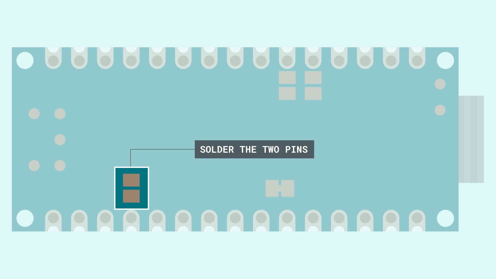


## UART Communication

The Nano 33 BLE Sense board features built-in UART (Universal Asynchronous Receiver-Transmitter) communication that allows your projects to communicate with other devices through serial data transmission. UART is implemented within the nRF52840 microcontroller and provides two separate hardware serial ports: one connected to the USB Micro connector for computer communication, and another available on pins `RX` and `TX` for external device communication.

UART is one of the most used device-to-device communication protocols, allowing asynchronous serial communication where the data format and transmission speed are configurable. The protocol sends data bits one by one, from the least significant to the most significant, framed by start and stop bits. Embedded systems, microcontrollers, and computers use UART as a form of device-to-device hardware communication that requires only two wires for transmitting and receiving data.

The Nano 33 BLE Sense's UART interface offers the following technical specifications:

|   **Parameter**   |  **Value**  |      **Notes**       |
| :---------------: | :---------: | :------------------: |
|    Baud Rates     |             | Common: 9600, 115200 |
|     Data Bits     |             | Standard data width  |
|   Communication   | Full-duplex |  Simultaneous TX/RX  |
|  Hardware Ports   |      2      | USB Serial + Serial1 |
|     UART Pins     | `RX`, `TX`  | RX, TX respectively  |
| Operating Voltage |  +3.3 VDC   |   TTL logic levels   |
|   Flow Control    |  Software   |  XON/XOFF supported  |

The Nano 33 BLE Sense board uses the following pins for UART communication:

| **Arduino Pin** | **Microcontroller Pin** | **UART Function** | **Description** |
| :-------------: | :---------------------: | :---------------: | :-------------: |
|      `RX`       |         `P1.10`         |      Receive      |  Receive Data   |
|      `TX`       |         `P1.03`         |     Transmit      |  Transmit Data  |

You can communicate via UART using the built-in `Serial` and `Serial1` objects. The `Serial` object is connected to the USB Micro port for computer communication, while `Serial1` is connected to pins `RX` and `TX` for external device communication.


The Nano 33 BLE Sense board provides two distinct UART communication channels, giving you the flexibility to handle multiple communication tasks simultaneously. The first channel is the USB Serial (`Serial`), which is your primary interface for programming and debugging. This channel offers several key features:

- Connected to the onboard USB Micro connector
- Used for programming and debugging
- Typically runs at 115200 baud
- Automatic baud rate detection
- No external connections required 

The second channel is the Hardware Serial (`Serial1`), which is dedicated to external device communication. This channel provides robust connectivity for your project peripherals:

- Connected to pins `RX` and `TX`
- Used for external device communication
- Configurable baud rate.
- TTL voltage levels (0 VDC/+3.3 VDC)
- Requires external device connection

Here is a practical example of reading incoming data from an external UART device::

```arduino
// Example: Reading data from external UART device
void readUARTData() {
  String incoming = "";
  
  while (Serial1.available()) {
    delay(2);  // Small delay for stability
    char c = Serial1.read();
    incoming += c;
  }
  
  if (incoming.length() > 0) {
    Serial.print("Received: ");
    Serial.println(incoming);
  }
}

// Example: Sending data to external UART device
void sendUARTData() {
  Serial1.write("Hello world!");
}
```

When working with UART on the Nano 33 BLE Sense, there are several key points to keep in mind:
- Voltage Levels: The UART operates at 3.3V TTL levels (0V for LOW, 3.3V for HIGH). Never connect 5V devices directly without a level shifter.

- Baud Rate Matching: Ensure both devices use the same baud rate, data bits (typically 8), stop bits (typically 1), and parity (typically none).

- Connection Pattern: Remember that TX connects to RX and RX connects to TX (crossover connection) when connecting two devices.

- Asynchronous Protocol: UART is asynchronous, meaning there's no clock signal. The baud rate must be identical on both transmitting and receiving devices.

- Dual Channel Advantage: Unlike some older Arduino boards, the Nano 33 BLE Sense has separate channels for USB and hardware UART, allowing simultaneous debugging and external communication.

## SPI Communication

The Nano 33 BLE Sense board features built-in SPI (Serial Peripheral Interface) communication that allows your projects to communicate with external devices like sensors, displays, memory cards, and other microcontrollers. SPI is implemented within the nRF52840 microcontroller and uses dedicated pins to provide high-speed synchronous serial communication.

SPI is particularly useful when your project needs to communicate with external components at high speeds. While I2C is suitable for simple sensor communication and UART for basic serial data exchange, SPI excels at high-speed communication with devices like SD cards, TFT displays, wireless modules, or external memory chips. SPI can achieve faster data rates than I2C and can handle multiple devices on the same bus through individual chip select lines.

The Nano 33 BLE Sense's SPI interface offers the following technical specifications:

|   **Parameter**   |           **Value**            |          **Notes**          |
| :---------------: | :----------------------------: | :-------------------------: |
|    Clock Speed    |                                |    Maximum SPI frequency    |
|   Data Transfer   |                                |     Standard data width     |
|   Communication   |          Full-duplex           |  Simultaneous send/receive  |
|     SPI Pins      | `D11`, `D12`, `D13` + any GPIO | `COPI`, `CIPO`, `SCK`, `CS` |
| Multiple Devices  |           Supported            |   Via different `CS` pins   |
| Operating Voltage |            +3.3 VDC            |        Same as board        |
| Protocol Support  |                                |   All SPI modes available   |

The Nano 33 BLE Sense board uses the following pins for SPI communication:

| **Arduino Pin** | **Microcontroller Pin** | **SPI Function** |        **Description**        |
| :-------------: | :---------------------: | :--------------: | :---------------------------: |
|      `D11`      |         `P1.01`         |      `COPI`      | Controller Out, Peripheral In |
|      `D12`      |         `P1.08`         |      `CIPO`      | Controller In, Peripheral Out |
|      `D13`      |         `P0.13`         |      `SCK`       |         Serial Clock          |
|    Any GPIO     |            -            |       `CS`       | Chip Select (any digital pin) |

***Note: The signal names have been updated from the traditional MOSI/MISO/SS to the modern COPI/CIPO/CS terminology for better clarity.***

You can communicate via SPI using the dedicated `SPI.h` library, which is included in the Arduino Mbed OS Nano Boards core. The library provides simple functions to initialize the bus, send and receive data and manage multiple devices.

The following example demonstrates how to use SPI communication:

```arduino
/**
SPI Basic Example for the Arduino Nano 33 BLE Sense Board
Name: nano_r4_spi_basic.ino
Purpose: This sketch demonstrates how to use SPI communication
to send and receive data.

@author Arduino Product Experience Team
@version 1.0 01/06/25
*/

#include <SPI.h>

// Chip Select pin for SPI device
const int CS_PIN = 10;

void setup() {
  // Initialize serial communication and wait up to 2.5 seconds for a connection
  Serial.begin(115200);
  for (auto startNow = millis() + 2500; !Serial && millis() < startNow; delay(500));
  
  Serial.println("- Arduino Nano 33 BLE Sense - SPI Basic Example started...");
  
  // Set CS pin as output and set it HIGH (inactive)
  pinMode(CS_PIN, OUTPUT);
  digitalWrite(CS_PIN, HIGH);
  
  // Initialize SPI communication
  SPI.begin();
  
  // Configure SPI settings
  // - Clock speed: 1 MHz (1000000 Hz)
  // - Data order: Most Significant Bit first
  // - Data mode: Mode 0 (Clock polarity = 0, Clock phase = 0)
  SPI.beginTransaction(SPISettings(1000000, MSBFIRST, SPI_MODE0));
  
  Serial.println("- SPI initialized successfully");
  Serial.println("- Ready to communicate with SPI devices");
  
  // Example: Send some test data
  sendSPIData();
}

void loop() {
  // Send a counter value every 2 seconds
  static int counter = 0;
  
  // Select the device (CS LOW)
  digitalWrite(CS_PIN, LOW);
  
  // Send counter value
  byte response = SPI.transfer(counter);
  
  // Deselect the device (CS HIGH)
  digitalWrite(CS_PIN, HIGH);
  
  // Display results
  Serial.print("- Sent: ");
  Serial.print(counter);
  Serial.print(" | Received: ");
  Serial.println(response);
  
  // Increment counter and wrap around at 255
  counter++;
  if (counter > 255) {
    counter = 0;
  }
  
  delay(2000);
}

void sendSPIData() {
  Serial.println("- Sending test data...");
  
  // Select the device
  digitalWrite(CS_PIN, LOW);
  
  // Send a sequence of test bytes
  for (int i = 0; i < 5; i++) {
    byte testData = 0x10 + i;  // Send 0x10, 0x11, 0x12, 0x13, 0x14
    byte response = SPI.transfer(testData);
    
    Serial.print("  Sent: 0x");
    if (testData < 16) Serial.print("0");
    Serial.print(testData, HEX);
    Serial.print(" | Received: 0x");
    if (response < 16) Serial.print("0");
    Serial.println(response, HEX);
    
    delay(100);
  }
  
  // Deselect the device
  digitalWrite(CS_PIN, HIGH);
  
  Serial.println("- Test data transmission complete");
}
```

***To test this example, connect an SPI-compatible device. Without a connected device, the received data will typically be `0xFF` or random values.***

You can open the Arduino IDE's Serial Monitor (Tools > Serial Monitor) to see the SPI communication in action.


For connecting multiple SPI devices, you can use different digital pins as Chip Select (`CS`) lines while sharing the `COPI`, `CIPO`, and `SCK` pins:

```arduino
// Multiple SPI device example
const int DEVICE1_CS = 10;  // First SPI device
const int DEVICE2_CS = 9;   // Second SPI device
const int DEVICE3_CS = 8;   // Third SPI device

void setup() {
  SPI.begin();
  
  // Configure all CS pins as outputs
  pinMode(DEVICE1_CS, OUTPUT);
  pinMode(DEVICE2_CS, OUTPUT);
  pinMode(DEVICE3_CS, OUTPUT);
  
  // Set all CS pins HIGH (inactive)
  digitalWrite(DEVICE1_CS, HIGH);
  digitalWrite(DEVICE2_CS, HIGH);
  digitalWrite(DEVICE3_CS, HIGH);
}

void communicateWithDevice(int csPin, byte address, byte data) {
  digitalWrite(csPin, LOW);    // Select device
  SPI.transfer(address);
  SPI.transfer(data);
  digitalWrite(csPin, HIGH);   // Deselect device
}
```

When working with SPI on the Nano 33 BLE Sense, there are several key points to keep in mind:

Voltage Levels: The SPI operates at 3.3V logic levels. Never connect 5V SPI devices directly without a level shifter.

- **Chip Select Management:** Only one device should be selected (`CS LOW`) at a time. Always deselect devices after communication.

- **Device Compatibility:** Different SPI devices may require specific clock speeds, modes, and protocols. Always consult your device's datasheet.

- **Synchronous Protocol:** SPI is synchronous, meaning data is transferred in both directions simultaneously with each clock pulse.

- **Flexible CS Pins:** Unlike some Arduino boards, you can use any digital pin as a Chip Select pin, providing flexibility for multiple devices.

- **Modern Terminology:** Use COPI (Controller Out, Peripheral In) instead of MOSI, and CIPO (Controller In, Peripheral Out) instead of MISO.

## I2C Communication

The Nano 33 BLE Sense board features built-in I2C (Inter-Integrated Circuit) communication that allows your projects to communicate with multiple devices using just two wires. I2C is implemented within the nRF52840 microcontroller and uses two dedicated pins to provide reliable serial communication with sensors, displays, memory modules, and other microcontrollers. This makes it perfect for projects that need to connect several devices without using many pins.

I2C is particularly useful when your project needs to communicate with multiple sensors and devices in a simple way. While SPI is excellent for high-speed communication and UART for basic serial data exchange, I2C excels at connecting many devices with minimal wiring. Multiple I2C devices can share the same two-wire bus, each with its own unique address, making it ideal for sensor networks, display modules, and expandable systems.

The Nano 33 BLE Sense's I2C interface offers the following technical specifications:

|   **Parameter**   |  **Value**  |        **Notes**        |
| :---------------: | :---------: | :---------------------: |
|    Clock Speed    |             |                         |
|   Data Transfer   |             |   Standard data width   |
|   Communication   | Half-duplex | One direction at a time |
|     I2C Pins      | `A4`, `A5`  |  SDA, SCL respectively  |
| Device Addressing |             |                         |
| Operating Voltage |  +3.3 VDC   |      Same as board      |

The Nano 33 BLE Sense uses the following pins for I2C communication:

| **Arduino Pin** | **Microcontroller Pin** | **I2C Function** |  **Description**  |
|:---------------:|:-----------------------:|:----------------:|:-----------------:|
|       `A4`      |          `P0.31`         |        SDA       |  Serial Data Line |
|       `A5`      |          `P0.02`         |        SCL       | Serial Clock Line |

You can communicate via I2C using the dedicated `Wire.h` library, which is included in the Arduino UNO R4 Boards core. The library provides simple functions to initialize the bus, send and receive data and manage multiple devices.

The following example demonstrates basic I2C communication patterns:

```arduino
/**
I2C Basic Example for the Arduino Nano 33 BLE Sense Board
Name: nano_r4_i2c_basic.ino
Purpose: This sketch demonstrates basic I2C communication
patterns for protocol analysis.

@author Arduino Product Experience Team
@version 1.0 01/06/25
*/

#include <Wire.h>

// Example device address
const int DEVICE_ADDRESS = 0x48;

void setup() {
  // Initialize serial communication and wait up to 2.5 seconds for a connection
  Serial.begin(115200);
  for (auto startNow = millis() + 2500; !Serial && millis() < startNow; delay(500));
  
  Serial.println("- Arduino Nano 33 BLE Sense - I2C Basic Example started...");
  
  // Initialize I2C communication as master
  Wire.begin();
  
  Serial.println("- I2C initialized successfully");
  Serial.println("- Connect protocol analyzer to A4 (SDA) and A5 (SCL)");
  Serial.println("- Starting I2C communication patterns...");
  
  delay(2000);
}

void loop() {
  // Write a single byte
  Serial.println("- Writing single byte (0xAA) to device 0x48...");
  Wire.beginTransmission(DEVICE_ADDRESS);
  Wire.write(0xAA);
  Wire.endTransmission();
  
  delay(1000);
  
  // Write multiple bytes
  Serial.println("- Writing multiple bytes (0x10, 0x20, 0x30) to device 0x48...");
  Wire.beginTransmission(DEVICE_ADDRESS);
  Wire.write(0x10);
  Wire.write(0x20);
  Wire.write(0x30);
  Wire.endTransmission();
  
  delay(1000);
  
  // Request data from device
  Serial.println("- Requesting 2 bytes from device 0x48...");
  Wire.requestFrom(DEVICE_ADDRESS, 2);
  
  // Read any available data
  while (Wire.available()) {
    int data = Wire.read();
    Serial.print("Received: 0x");
    if (data < 16) Serial.print("0");
    Serial.println(data, HEX);
  }
  
  delay(2000);
  Serial.println("---");
}
```
***To test this example, no external I2C devices are required. The code will generate I2C communication patterns that can be analyzed with a protocol analyzer. Without devices connected, read operations will typically return `0xFF`.***

You can open the Arduino IDE's Serial Monitor (Tools > Serial Monitor) to see the I2C operations being performed. Connect a protocol analyzer to pins `A4` (SDA) and `A5` (SCL) to observe the actual I2C protocol signals.


***The I2C protocol requires pull-up resistors on both SDA and SCL lines. __The Nano 33 BLE Sense board does not have internal pull-ups on `A4` and `A5` to avoid interference with their analog input functionality, so external 4.7kΩ pull-up resistors to +5 VDC are required for proper I2C operation__.***

One of the main advantages of I2C is the ability to connect multiple devices to the same bus. Here is how to connect multiple I2C devices:

```arduino
// Example: Communicating with multiple I2C devices
void communicateWithMultipleDevices() {
  // Device addresses (examples)
  const int SENSOR_ADDRESS = 0x48;    // Temperature sensor
  const int DISPLAY_ADDRESS = 0x3C;   // OLED display
  const int EEPROM_ADDRESS = 0x50;    // External EEPROM
  
  // Read from temperature sensor
  Wire.beginTransmission(SENSOR_ADDRESS);
  Wire.write(0x00);  // Register to read
  Wire.endTransmission();
  
  Wire.requestFrom(SENSOR_ADDRESS, 2);
  if (Wire.available() >= 2) {
    int tempHigh = Wire.read();
    int tempLow = Wire.read();
    Serial.print("Temperature: ");
    Serial.println((tempHigh << 8) | tempLow);
  }
  
  // Send data to display
  Wire.beginTransmission(DISPLAY_ADDRESS);
  Wire.write(0x40);  // Data mode
  Wire.write(0xFF);  // Sample data
  Wire.endTransmission();
  
  // Write to EEPROM
  Wire.beginTransmission(EEPROM_ADDRESS);
  Wire.write(0x00);  // Memory address
  Wire.write(0x55);  // Data to write
  Wire.endTransmission();
}
```

When working with I2C on the Nano 33 BLE Sense board, there are several key points to keep in mind for successful implementation:

- Each I2C device must have a unique address on the bus, so check device datasheets to avoid address conflicts.
- Keep in mind that I2C is a half-duplex protocol, meaning data flows in only one direction at a time. The master device (your Nano 33 BLE Sense board) controls the clock line and initiates all communication.
- When connecting multiple devices, simply connect all SDA pins together and all SCL pins together, along with power and ground connections.
- The Nano 33 BLE Sense board can communicate with up to 127 different I2C devices on the same bus, making it perfect for complex sensor networks and expandable systems.

## Bluetooth®

To enable Bluetooth® on the Nano 33 BLE Sense, we can use the [ArduinoBLE](https://www.arduino.cc/en/Reference/ArduinoBLE) library, and include it at the top of our sketch:

```arduino
#include <ArduinoBLE.h>
```

Set the service and characteristic:

```arduino
BLEService ledService("180A"); // BLE LED Service
BLEByteCharacteristic switchCharacteristic("2A57", BLERead | BLEWrite);
```

Set advertised name and service:

```arduino
  BLE.setLocalName("Nano 33 BLE Sense");
  BLE.setAdvertisedService(ledService);
```

Start advertising:

```arduino
BLE.advertise();
```

Listen for Bluetooth® Low Energy peripherals to connect:

```arduino  
BLEDevice central = BLE.central();
```

Here is an example of turning on an RGB LED over Bluetooth®:
```arduino
#include <ArduinoBLE.h>

BLEService ledService("180A"); // BLE LED Service

// BLE LED Switch Characteristic - custom 128-bit UUID, read and writable by central
BLEByteCharacteristic switchCharacteristic("2A57", BLERead | BLEWrite);

void setup() {
  Serial.begin(9600);
  while (!Serial);

  // set LED's pin to output mode
  pinMode(LEDR, OUTPUT);
  pinMode(LEDG, OUTPUT);
  pinMode(LEDB, OUTPUT);
  pinMode(LED_BUILTIN, OUTPUT);
  
  digitalWrite(LED_BUILTIN, LOW);         // when the central disconnects, turn off the LED
  digitalWrite(LEDR, HIGH);               // will turn the LED off
  digitalWrite(LEDG, HIGH);               // will turn the LED off
  digitalWrite(LEDB, HIGH);                // will turn the LED off

  // begin initialization
  if (!BLE.begin()) {
    Serial.println("starting Bluetooth® Low Energy failed!");

    while (1);
  }

  // set advertised local name and service UUID:
  BLE.setLocalName("Nano 33 BLE Sense");
  BLE.setAdvertisedService(ledService);

  // add the characteristic to the service
  ledService.addCharacteristic(switchCharacteristic);

  // add service
  BLE.addService(ledService);

  // set the initial value for the characteristic:
  switchCharacteristic.writeValue(0);

  // start advertising
  BLE.advertise();

  Serial.println("BLE LED Peripheral");
}

void loop() {
  // listen for Bluetooth® Low Energy peripherals to connect:
  BLEDevice central = BLE.central();

  // if a central is connected to peripheral:
  if (central) {
    Serial.print("Connected to central: ");
    // print the central's MAC address:
    Serial.println(central.address());
    digitalWrite(LED_BUILTIN, HIGH);            // turn on the LED to indicate the connection

    // while the central is still connected to peripheral:
    while (central.connected()) {
      // if the remote device wrote to the characteristic,
      // use the value to control the LED:
      if (switchCharacteristic.written()) {
        switch (switchCharacteristic.value()) {   // any value other than 0
          case 01:
            Serial.println("Red LED on");
            digitalWrite(LEDR, LOW);            // will turn the LED on
            digitalWrite(LEDG, HIGH);         // will turn the LED off
            digitalWrite(LEDB, HIGH);         // will turn the LED off
            break;
          case 02:
            Serial.println("Green LED on");
            digitalWrite(LEDR, HIGH);         // will turn the LED off
            digitalWrite(LEDG, LOW);        // will turn the LED on
            digitalWrite(LEDB, HIGH);        // will turn the LED off
            break;
          case 03:
            Serial.println("Blue LED on");
            digitalWrite(LEDR, HIGH);         // will turn the LED off
            digitalWrite(LEDG, HIGH);       // will turn the LED off
            digitalWrite(LEDB, LOW);         // will turn the LED on
            break;
          default:
            Serial.println(F("LEDs off"));
            digitalWrite(LEDR, HIGH);          // will turn the LED off
            digitalWrite(LEDG, HIGH);        // will turn the LED off
            digitalWrite(LEDB, HIGH);         // will turn the LED off
            break;
        }
      }
    }

    // when the central disconnects, print it out:
    Serial.print(F("Disconnected from central: "));
    Serial.println(central.address());
    digitalWrite(LED_BUILTIN, LOW);         // when the central disconnects, turn off the LED
    digitalWrite(LEDR, HIGH);          // will turn the LED off
    digitalWrite(LEDG, HIGH);        // will turn the LED off
    digitalWrite(LEDB, HIGH);         // will turn the LED off
  }
}
```

Once we are finished with the coding, we can upload the sketch to the board. When it has successfully uploaded, open the Serial Monitor. In the Serial Monitor, the text **"BLE LED Peripheral"** will appear as seen in the image below.

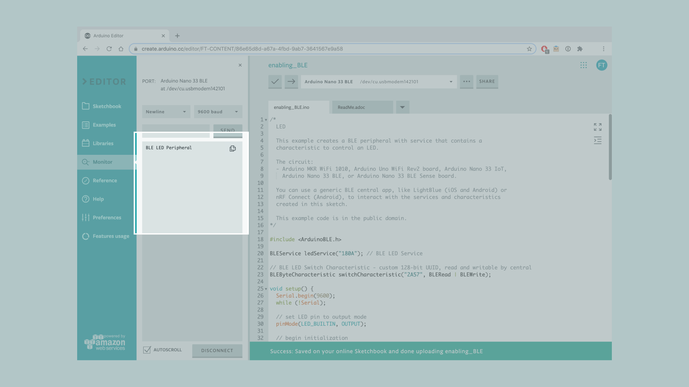

We can now discover our Nano 33 BLE Sense board in the list of available Bluetooth® devices. To access the service and characteristic we recommend using the **LightBlue** application. Follow <a href="https://apps.apple.com/us/app/lightblue/id557428110">this link for iPhones</a> or <a href="https://play.google.com/store/apps/details?id=com.punchthrough.lightblueexplorer&hl=en">this link for Android phones</a>.

Once we have the application open, follow the image below for instructions:

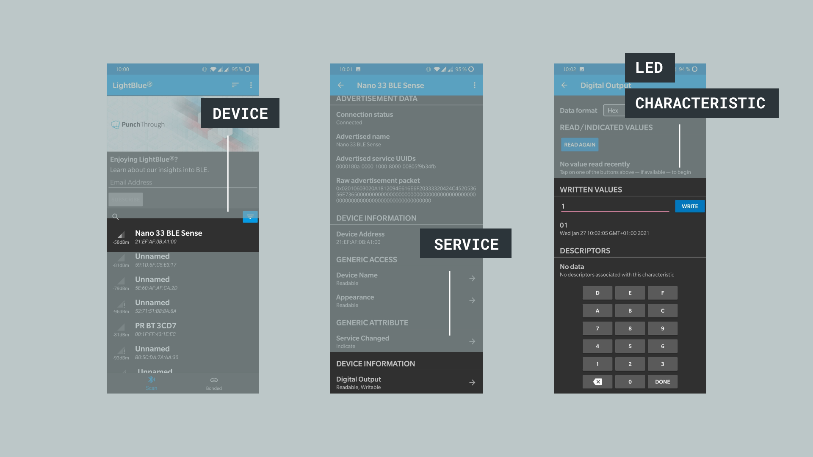

To control the RGB LED, we simply need to write 1,2 or 3 in the "WRITTEN VALUES" field to turn on the red, blue or the green LED and any other value to turn them off. This is within the **"Digital Output"** characteristic, which is located under **"Device Information"**.

## IMU Sensor

IMU stands for: inertial measurement unit. It is an electronic device that measures and reports a body's specific force, angular rate and the orientation of the body, using a combination of accelerometers, gyroscopes, and oftentimes magnetometers.

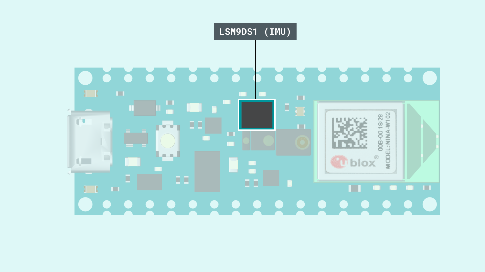

The LSM9DS1 is a system-in-package featuring a 3D digital linear acceleration sensor, a 3D digital angular rate sensor, and a 3D digital magnetic sensor.

To access the data from the LSM9DS1 module, we need to install the LSM9DS1 library, which comes with examples that can be used directly with the Nano 33 BLE Sense.

It can be installed directly from the library manager through the IDE of your choice. To use it, we need to include it at the top of the sketch:

```arduino
#include <Arduino_LSM9DS1.h>
```
And to initialize the library, we can use the following command inside `void setup()`.

```arduino
  if (!IMU.begin()) {
    Serial.println("Failed to initialize IMU!");
    while (1);
  }
```
### Accelerometer
An accelerometer is an electromechanical device used to measure acceleration forces. Such forces may be static, like the continuous force of gravity or, as is the case with many mobile devices, dynamic to sense movement or vibrations.

The accelerometer data can be accessed through the following commands:

```arduino
  float x, y, z;

  if (IMU.accelerationAvailable()) {
    IMU.readAcceleration(x, y, z);
  }
```
Here is an example of using the accelerometer as a "level" that will provide information about the position of the board. With this application we will be able to read what the relative position of the board is as well as the degrees, by tilting the board up, down, left or right:

```arduino
/*
  Arduino LSM9DS1 - Accelerometer Application

  This example reads the acceleration values as relative direction and degrees,
  from the LSM9DS1 sensor and prints them to the Serial Monitor or Serial Plotter.

  The circuit:
  - Arduino Nano 33 BLE Sense

  Created by Riccardo Rizzo

  Modified by Jose García
  27 Nov 2020

  This example code is in the public domain.
*/

#include <Arduino_LSM9DS1.h>

float x, y, z;
int degreesX = 0;
int degreesY = 0;

void setup() {
  Serial.begin(9600);
  while (!Serial);
  Serial.println("Started");

  if (!IMU.begin()) {
    Serial.println("Failed to initialize IMU!");
    while (1);
  }

  Serial.print("Accelerometer sample rate = ");
  Serial.print(IMU.accelerationSampleRate());
  Serial.println("Hz");
}

void loop() {

  if (IMU.accelerationAvailable()) {
    IMU.readAcceleration(x, y, z);

  }

  if (x > 0.1) {
    x = 100 * x;
    degreesX = map(x, 0, 97, 0, 90);
    Serial.print("Tilting up ");
    Serial.print(degreesX);
    Serial.println("  degrees");
  }
  if (x < -0.1) {
    x = 100 * x;
    degreesX = map(x, 0, -100, 0, 90);
    Serial.print("Tilting down ");
    Serial.print(degreesX);
    Serial.println("  degrees");
  }
  if (y > 0.1) {
    y = 100 * y;
    degreesY = map(y, 0, 97, 0, 90);
    Serial.print("Tilting left ");
    Serial.print(degreesY);
    Serial.println("  degrees");
  }
  if (y < -0.1) {
    y = 100 * y;
    degreesY = map(y, 0, -100, 0, 90);
    Serial.print("Tilting right ");
    Serial.print(degreesY);
    Serial.println("  degrees");
  }
  delay(1000);
}
```
In order to get a correct reading of the board data, before uploading the sketch to the board hold the board in your hand, from the side of the USB port. The board should be facing up and "pointing" away from you. The image below illustrates the board's position and how it works:

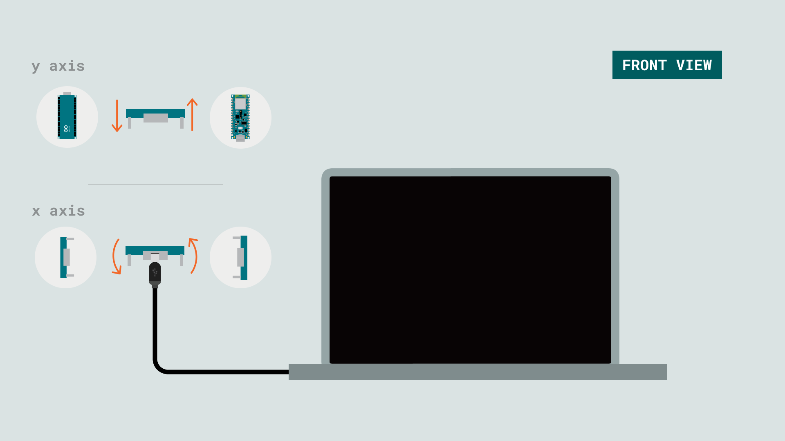

Now, you can verify and upload the sketch to the board and open the Monitor from the menu on the left.  

If you tilt the board upwards, downwards, right or left, you will see the results printing every second according to the direction of your movement!

Here is a screenshot of the sketch returning these values:

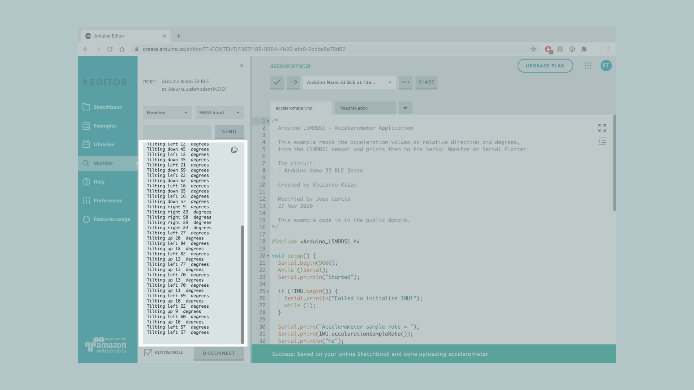


### Gyroscope

A gyroscope sensor is a device that can measure and maintain the orientation and angular velocity of an object. Gyroscopes are more advanced than accelerometers, as they can measure the tilt and lateral orientation of an object, whereas an accelerometer can only measure its linear motion.

The gyroscope data can be accessed through the following commands:

```arduino
  float x, y, z;

  if (IMU.gyroscopeAvailable()) {
    IMU.readGyroscope(x, y, z);
  }
```

Gyroscope sensors are also called "Angular Rate Sensors" or "Angular Velocity Sensors". Measured in degrees per second, angular velocity is the change in the rotational angle of the object per unit of time.

Here is an example of using the gyroscope as an indicator for the direction of the force that is applied to the board. This will be achieved by swiftly moving the board for an instant in four directions: forward, backward, to the left and to the right. The results will be visible through the Serial Monitor.

```arduino
/*
  Arduino LSM9DS1 - Gyroscope Application

  This example reads the gyroscope values from the LSM9DS1 sensor 
  and prints them to the Serial Monitor or Serial Plotter, as a directional detection of 
  an axis' angular velocity.

  The circuit:
  - Arduino Nano 33 BLE Sense

  Created by Riccardo Rizzo

  Modified by Benjamin Dannegård
  30 Nov 2020

  This example code is in the public domain.
*/

#include <Arduino_LSM9DS1.h>

float x, y, z;
int plusThreshold = 30, minusThreshold = -30;

void setup() {
  Serial.begin(9600);
  while (!Serial);
  Serial.println("Started");

  if (!IMU.begin()) {
    Serial.println("Failed to initialize IMU!");
    while (1);
  }
  Serial.print("Gyroscope sample rate = ");
  Serial.print(IMU.gyroscopeSampleRate());
  Serial.println(" Hz");
  Serial.println();
  Serial.println("Gyroscope in degrees/second");
}
void loop() {
  
  if (IMU.gyroscopeAvailable()) {
    IMU.readGyroscope(x, y, z);
  }
  if(y > plusThreshold)
  {
    Serial.println("Collision front");
    delay(500);
  }
  if(y < minusThreshold)
  {
    Serial.println("Collision back");
    delay(500);
  }
  if(x < minusThreshold)
  {
    Serial.println("Collision right");
    delay(500);
  }
    if(x > plusThreshold)
  {
    Serial.println("Collision left");
    delay(500);
  }
  
}
```
In order to get a correct reading of the board data, before uploading the sketch to the board hold the board in your hand, from the side of the USB port. The board should be facing up and "pointing" away from you. The image below illustrates the board's position and how it works:

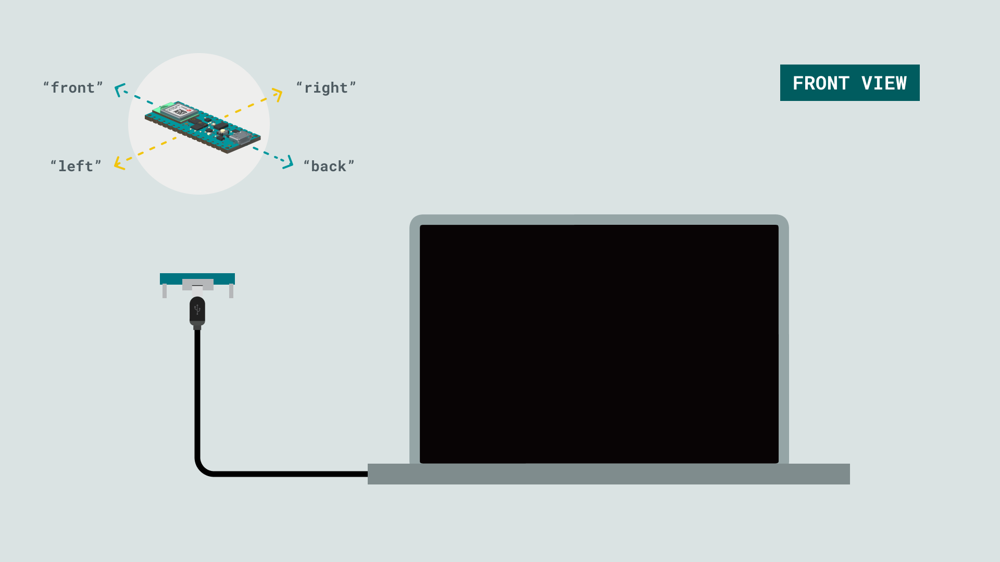

Next, you can verify and upload the sketch to the board and open the Monitor from the menu on the left.  

Now with the board parallel to the ground you can swiftly move it towards one direction: forward, backwards, right or left. According to the movement of your choice, the results will print every second to your monitor!


Here is a screenshot of the sketch returning these values:

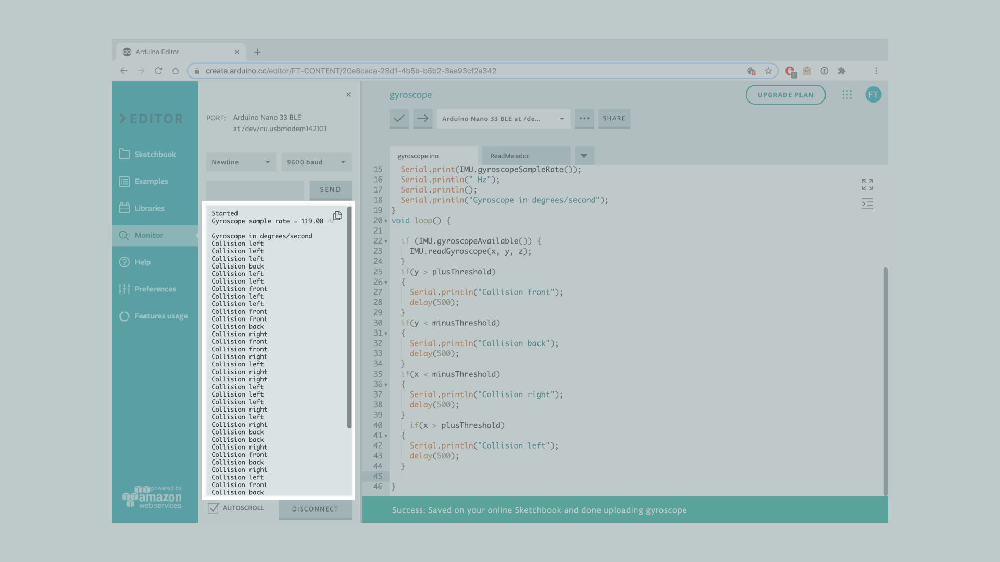

### Magnetometer

A magnetometer is a device that measures magnetism, that is the direction, strength, or relative change of a magnetic field at a particular location.


The magnetometer data can be accessed through the following commands:

```arduino
  float x, y, z;

  IMU.readMagneticField(x, y, z);
```

Here is an example for reading the values X, Y and Z and provide visual feedback through the in-built LED according to the intensity of magnetism around an electric object's cord.

```arduino
/*
  Arduino LSM9DS1 - Magnetometer

  This example reads the magnetometer's values from the LSM9DS1 sensor 
  and `analogWrite` the built-in LED according to the intensity of
  the magnetic field surrounding electrical devices.

  The circuit:
  - Arduino Nano 33 BLE Sense

  Created by Benjamin Dannegård
  4 Dec 2020

  This example code is in the public domain.
*/


#include <Arduino_LSM9DS1.h>
float x,y,z, ledvalue;

void setup() {
  IMU.begin();
}

void loop() {
  
  // read magnetic field in all three directions
  IMU.readMagneticField(x, y, z);
  
  if(x < 0)
  {
    ledvalue = -(x);
  }
  else{
    ledvalue = x;
  }
  
  analogWrite(LED_BUILTIN, ledvalue);
  delay(500);
}
```

After you have successfully verified and uploaded the sketch to the board, it's time to put it to the test. You can choose an electric appliance at home or any object that runs with electrical current. For example, in this tutorial we will use a laptop charger to test it out. 

Place your board on top of the laptop's charging cord for 5-10 seconds and then move it away from it for some seconds again. While the board is close to the cord you should notice the (orange) built-in LED blinking. The intensity of the LED will vary according to the magnetic field detected.

Here is a screenshot illustrating the board's position:

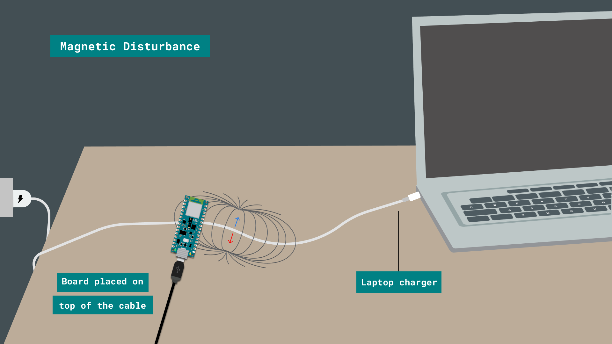

### Proximity and Gesture Sensor

The APDS9960 chip allows for measuring digital proximity and ambient light as well as for detecting RGB colors and gestures.

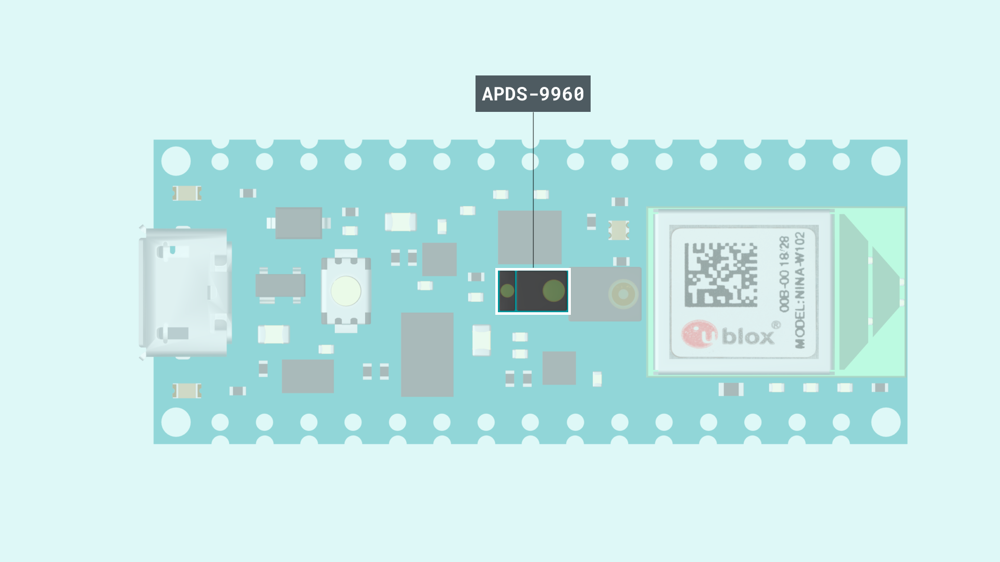

The sensor's gesture detection utilizes four directional photodiodes to sense reflected infrared (IR) energy, sourced by the integrated LED, to convert physical motion information (i.e. velocity, direction and distance) into digital information.

It features:

- Four separate diodes sensitive to different directions.
- Ambient light rejection.
- Offset compensation.
- Programmable driver for IR LED current.
- 32 dataset storage FIFO.
- Interrupt driven I2C-bus communication.

To access the data from the APDS9960 module, we need to install the [APDS9960](https://github.com/arduino-libraries/Arduino_APDS9960) library, which comes with examples that can be used directly with the Nano 33 BLE Sense.

It can be installed directly from the library manager through the IDE of your choice. To use it, we need to include it at the top of the sketch:

```arduino
#include <Arduino_APDS9960.h>
```

And to initialize the library, we can use the following command inside `void setup()`.

```arduino
if (!APDS.begin()) {
  Serial.println("Error initializing APDS9960 sensor!");
}
```

Then we check if there is data available from the proximity sensor. If there is we can print the value in the serial monitor. The value can range between 0-255, where 0 is close and 255 is far away. If it prints the value -1, it indicates an error.

```arduino
if (APDS.proximityAvailable()) {
  Serial.println(APDS.readProximity());
}
```

### Proximity Detection

Here is an example for printing out simple proximity detections and control the board's RGB LED accordingly. In addition to programming the board to change the colors of the RGB LED according to the proximity of an object to the board.

```arduino
#include <Arduino_APDS9960.h>

int ledState = LOW;

unsigned long previousMillis = 0;

const long intervalLong = 1000;
const long intervalMed = 500;
const long intervalShort = 100;

void setup() {
  Serial.begin(9600);
  while (!Serial);

  if (!APDS.begin()) {
    Serial.println("Error initializing APDS9960 sensor!");
  }

  // set the LEDs pins as outputs
  pinMode(LEDR, OUTPUT);
  pinMode(LEDG, OUTPUT);
  pinMode(LEDB, OUTPUT);

  // turn all the LEDs off
  digitalWrite(LEDR, HIGH);
  digitalWrite(LEDG, HIGH);
  digitalWrite(LEDB, HIGH);
}

void loop() {
  unsigned long currentMillis = millis();

  // check if a proximity reading is available
  if (APDS.proximityAvailable()) {
    // read the proximity
    // - 0   => close
    // - 255 => far
    // - -1  => error
    int proximity = APDS.readProximity();

    if (proximity > 150) {
      if (currentMillis - previousMillis >= intervalLong) {
        previousMillis = currentMillis;

        // if the LED is off turn it on and vice-versa:
        if (ledState == LOW) {
          ledState = HIGH;
        } else {
          ledState = LOW;
        }

        // set the green LED with the ledState of the variable and turn off the rest
        digitalWrite(LEDG, ledState);
        digitalWrite(LEDR, HIGH);
        digitalWrite(LEDB, HIGH);
      }
    }

    else if(proximity > 50 && proximity <= 150){
      if (currentMillis - previousMillis >= intervalMed) {
        previousMillis = currentMillis;

        // if the LED is off turn it on and vice-versa:
        if (ledState == LOW) {
          ledState = HIGH;
        } else {
          ledState = LOW;
        }

        // set the blue LED with the ledState of the variable and turn off the rest
        digitalWrite(LEDB, ledState);
        digitalWrite(LEDR, HIGH);
        digitalWrite(LEDG, HIGH);
      }
    }

    else {
      if (currentMillis - previousMillis >= intervalShort) {
        previousMillis = currentMillis;

        // if the LED is off turn it on and vice-versa:
        if (ledState == LOW) {
          ledState = HIGH;
        } else {
          ledState = LOW;
        }

        // set the blue LED with the ledState of the variable and turn off the rest
        digitalWrite(LEDR, ledState);
        digitalWrite(LEDB, HIGH);
        digitalWrite(LEDG, HIGH);
      }
    }

    // print value to the Serial Monitor
    Serial.println(proximity);
  }
}
```

After you have successfully verified and uploaded the sketch to the board, open the Serial Monitor from the menu on the left.

In order to test out the code, you could begin by stabilizing your board on a standing position in front of you (USB port facing down) and moving an object up and down close to the board. You will see the values on the Serial Monitor changing and changing the color of the RGB LED and the blinking time.

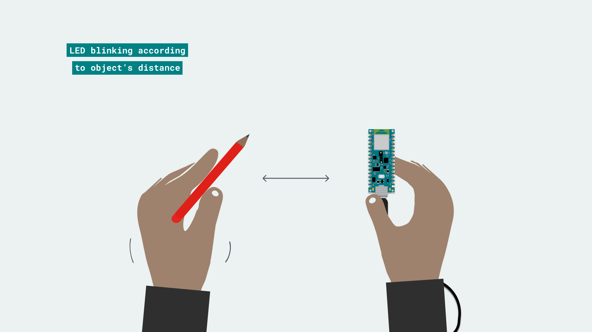


Here is a screenshot example of the sketch returning values through the Serial Monitor.

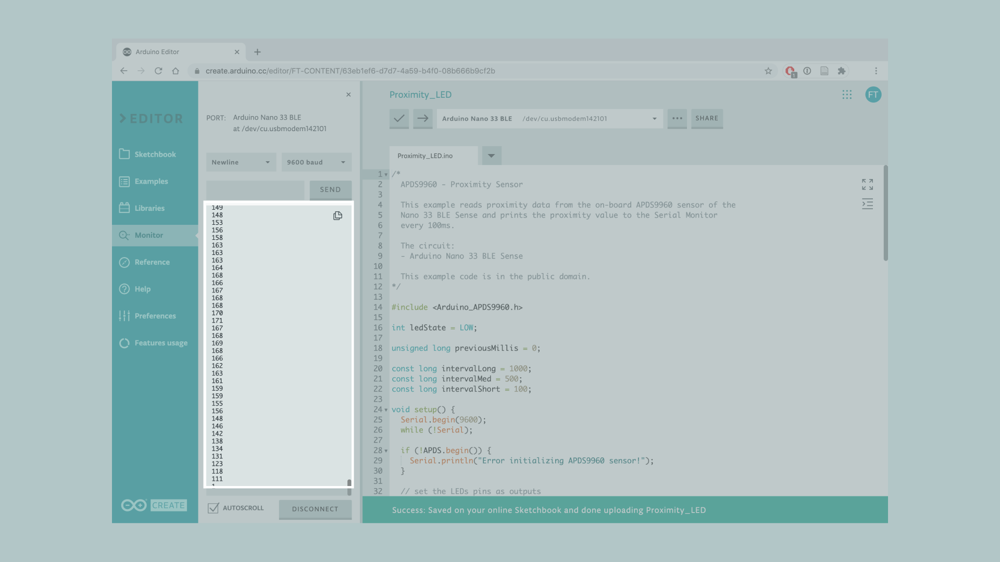

### Gesture Recognition

Here is an example for printing out simple hand gesture directions and control the board's RGB LED accordingly. In addition to programming the board to blink the built-in LED and change colors to the RGB LED according to the direction of the set gestures. The code will read simple Up-Down-Right-Left hand motions.

```arduino
/*
  APDS9960 - Gesture Sensor
  This example reads gesture data from the on-board APDS9960 sensor of the
  Nano 33 BLE Sense and prints any detected gestures to the Serial Monitor.
  Gesture directions are as follows:
  - UP:    from USB connector towards antenna
  - DOWN:  from antenna towards USB connector
  - LEFT:  from analog pins side towards digital pins side
  - RIGHT: from digital pins side towards analog pins side
  The circuit:
  - Arduino Nano 33 BLE Sense
  This example code is in the public domain.
*/

#include <Arduino_APDS9960.h>

void setup() {
  Serial.begin(9600);
  //in-built LED
  pinMode(LED_BUILTIN, OUTPUT);
  //Red
  pinMode(LEDR, OUTPUT);
  //Green
  pinMode(LEDG, OUTPUT);
  //Blue
  pinMode(LEDB, OUTPUT);
  
  while (!Serial);
  if (!APDS.begin()) {
    Serial.println("Error initializing APDS9960 sensor!");
  }
  // for setGestureSensitivity(..) a value between 1 and 100 is required.
  // Higher values makes the gesture recognition more sensible but less accurate
  // (a wrong gesture may be detected). Lower values makes the gesture recognition
  // more accurate but less sensible (some gestures may be missed).
  // Default is 80
  //APDS.setGestureSensitivity(80);
  Serial.println("Detecting gestures ...");
  // Turining OFF the RGB LEDs
  digitalWrite(LEDR, HIGH);
  digitalWrite(LEDG, HIGH);
  digitalWrite(LEDB, HIGH);
}
void loop() {
  if (APDS.gestureAvailable()) {
    // a gesture was detected, read and print to serial monitor
    int gesture = APDS.readGesture();
    switch (gesture) {
      case GESTURE_UP:
        Serial.println("Detected UP gesture");
        digitalWrite(LEDR, LOW);
        delay(1000);
        digitalWrite(LEDR, HIGH);
        break;
      case GESTURE_DOWN:
        Serial.println("Detected DOWN gesture");
        digitalWrite(LEDG, LOW);
        delay(1000);
        digitalWrite(LEDG, HIGH);
        break;
      case GESTURE_LEFT:
        Serial.println("Detected LEFT gesture");
        digitalWrite(LEDB, LOW);
        delay(1000);
        digitalWrite(LEDB, HIGH);
        break;
      case GESTURE_RIGHT:
        Serial.println("Detected RIGHT gesture");
        digitalWrite(LED_BUILTIN, HIGH);
        delay(1000);
        digitalWrite(LED_BUILTIN, LOW);
        break;
      default:
        break;
    }
  }
}
```

In order to test out the code, you could begin by stabilizing your board on a standing position in front of you (USB port facing down) and carry on by making directional UP-DOWN-RIGHT-LEFT hand gestures. Try to make your movement as clear as possible, yet subtle enough for the sensor to pick it up. 

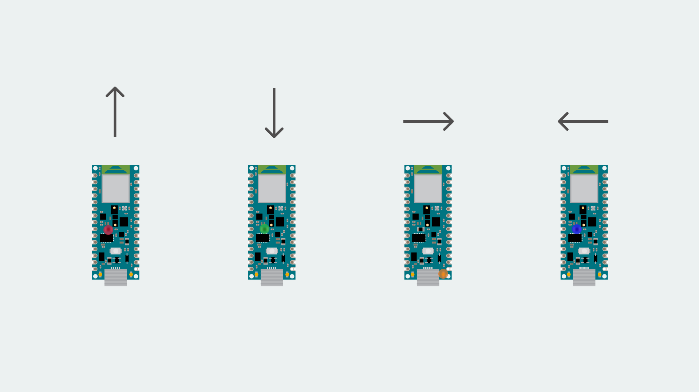


Here is a screenshot example of the sketch returning values.

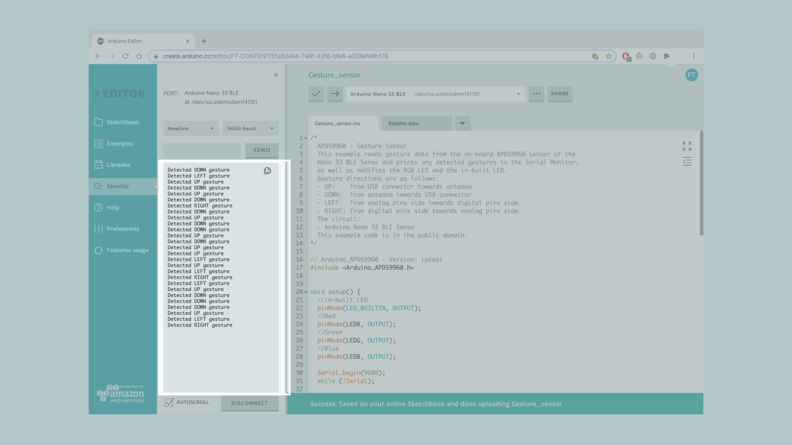 

## Temperature and Humidity Sensor

The HTS221 is an ultra-compact sensor for relative humidity and temperature. We will use the I2C protocol to communicate with the sensor and get data from it. The sensor's range of different values are the following:

- Humidity accuracy: ± 3.5% rH, 20 to +80% rH
- Humidity range: 0 to 100 %
- Temperature accuracy: ± 0.5 °C,15 to +40 °C
- Temperature range: -40 to 120°C

To access the data from the HTS221 module, we need to install the [HTS221](https://github.com/arduino-libraries/Arduino_HTS221) library, which comes with examples that can be used directly with the Nano 33 BLE Sense.

It can be installed directly from the library manager through the IDE of your choice. To use it, we need to include it at the top of the sketch:

```arduino
#include <Arduino_HTS221.h>
```

And to initialize the library, we can use the following command inside `void setup()`.

```arduino
if (!HTS.begin()) {
  Serial.println("Failed to initialize humidity temperature sensor!");
}
```

Then we can print our values in the serial monitor to check the temperature and humidity values.

```arduino
Serial.println(HTS.readTemperature());
Serial.println(HTS.readHumidity());
```

### Reading Temperature & Humidity

Here is an example for measuring and printing out the humidity and temperature values of your surroundings. 

```arduino
/*
  HTS221 - Read Sensors

  This example reads data from the on-board HTS221 sensor of the
  Nano 33 BLE Sense and prints the temperature and humidity sensor
  values to the Serial Monitor once a second.

  The circuit:
  - Arduino Nano 33 BLE Sense

  This example code is in the public domain.
*/

#include <Arduino_HTS221.h>

float old_temp = 0;
float old_hum = 0;

void setup() {
  Serial.begin(9600);
  while (!Serial);

  if (!HTS.begin()) {
    Serial.println("Failed to initialize humidity temperature sensor!");
    while (1);
  }
}

void loop() {
  // read all the sensor values
  float temperature = HTS.readTemperature();
  float humidity    = HTS.readHumidity();

  // check if the range values in temperature are bigger than 0,5 ºC
  // and if the range values in humidity are bigger than 1%
  if (abs(old_temp - temperature) >= 0.5 || abs(old_hum - humidity) >= 1 )
  {
    old_temp = temperature;
    old_hum = humidity;
    // print each of the sensor values
    Serial.print("Temperature = ");
    Serial.print(temperature);
    Serial.println(" °C");
    Serial.print("Humidity    = ");
    Serial.print(humidity);
    Serial.println(" %");
    Serial.println();
  }

  // print each of the sensor values
  Serial.print("Temperature = ");
  Serial.print(temperature);
  Serial.println(" °C");

  Serial.print("Humidity    = ");
  Serial.print(humidity);
  Serial.println(" %");

  // print an empty line
  Serial.println();

  // wait 1 second to print again
  delay(1000);
}
```
After you have successfully verified and uploaded the sketch to the board, open the Serial Monitor from the menu on the left. You will now see the new values printed. If you want to test out whether it is working, you could slightly breathe (exhale) on your board and watch new values when the humidity, as well as the temperature, levels rise or decrease. 

The following image shows how the data should be displayed.

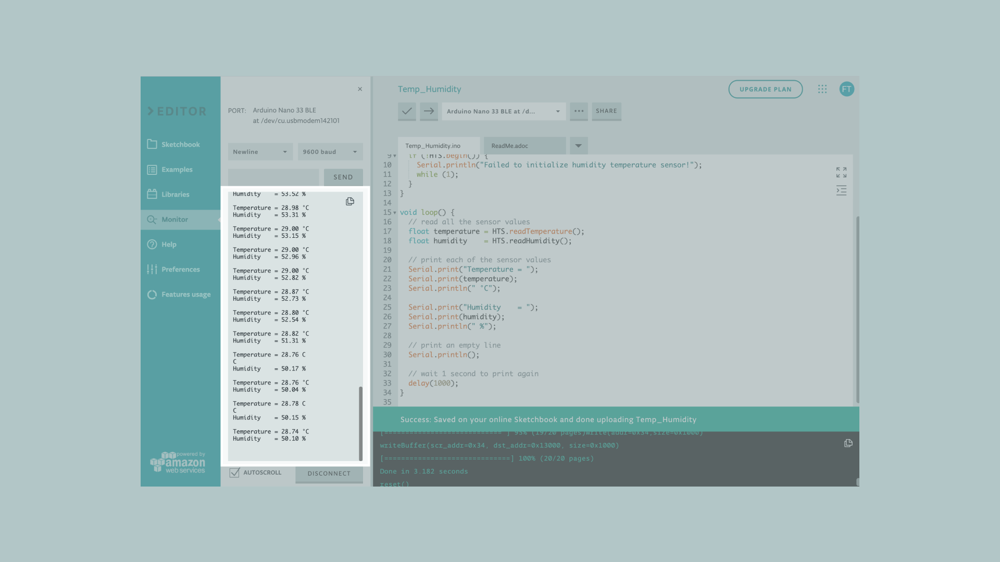

## Barometric Pressure Sensor

The **LPS22HB** picks up on barometric pressure and allows for a 24-bit pressure data output between 260 to 1260 hPa. This data can also be processed to calculate the height above sea level of the current location.

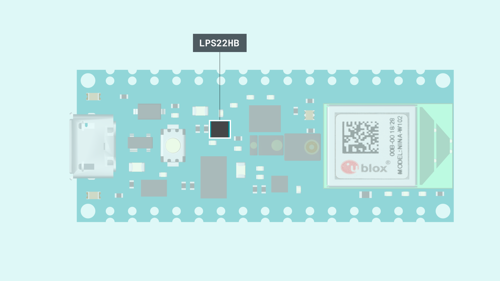

The sensing element, which detects absolute pressure, consists of a suspended silicon membrane and it operates over a temperature range extending from -40 °C to +85 °C. 

To access the data from the LPS22HB module, we need to install the [LPS22HB](https://github.com/arduino-libraries/Arduino_LPS22HB) library, which comes with examples that can be used directly with the Nano 33 BLE Sense.

It can be installed directly from the library manager through the IDE of your choice. To use it, we need to include it at the top of the sketch:

```arduino
#include <Arduino_LPS22HB.h>
```

And to initialize the library, we can use the following command inside `void setup()`.

```arduino
if (!BARO.begin()) {
  Serial.println("Failed to initialize pressure sensor!");
}
```

Then we can read the values from the sensor using the code below.

```arduino
BARO.readPressure();
```
### Access Barometric Presure Sensor Data

Here is an example for calculating the approximate altitude above sea level through the measurement of the atmospheric pressure.

```arduino
/*
  LPS22HB - Read Pressure

  This example reads data from the on-board LPS22HB sensor of the Nano 33 BLE Sense, 
  converts the atmospheric pressure sensor values to altitude above sea level,
  and prints them to the Serial Monitor every second.

  The circuit:
  - Arduino Nano 33 BLE Sense

  This example code is in the public domain.
*/

#include <Arduino_LPS22HB.h>


void setup() {
  Serial.begin(9600);
  while (!Serial);

  if (!BARO.begin()) {
    Serial.println("Failed to initialize pressure sensor!");
    while (1);
  }
}

void loop() {
  // read the sensor value
  float pressure = BARO.readPressure();
  
 
  float altitude = 44330 * ( 1 - pow(pressure/101.325, 1/5.255) );
  

  // print the sensor value
  Serial.print("Altitude according to kPa is = ");
  Serial.print(altitude);
  Serial.println(" m");

  // print an empty line
  Serial.println();

  // wait 1 second to print again
  delay(1000);
}
```

After verififying and uploading the sketch to the board, open the Serial Monitor from the menu on the left. In order to test out the code, you could begin by stabilizing your board on a fixed position and observe the values returned through the Serial Monitor. Here is a screenshot example of the sketch returning values.

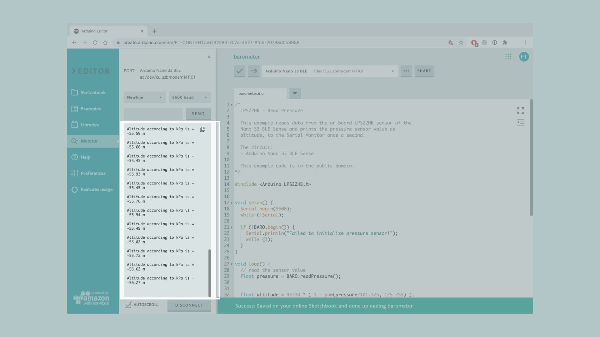 

## Microphone

The **MP34DT05** is a compact, low-power omnidirectional digital MEMS microphone with an IC interface. The MP34DT05 sensor is a ultra-compact microphone that use PDM (Pulse-Density Modulation) to represent an analog signal with a binary signal. The sensor's range of different values are the following:

- Signal-to-noise ratio: 64dB
- Sensitivity: -26dBFS ±3dB
- Temperature range: -40 to 85°C

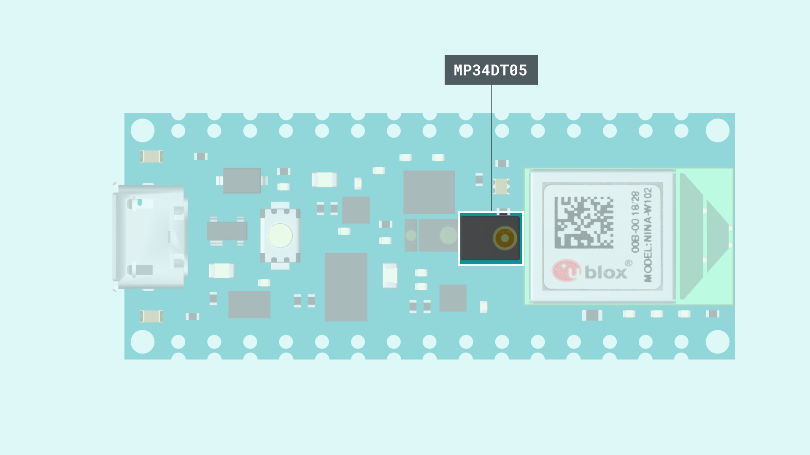 

To access the data from the MP34DT05, we need to use the [PDM](https://www.arduino.cc/en/Reference/PDM) library that is included in the **Arduino Mbed OS Nano Boards Package**. If the Board Package is installed, you will find an example that works by browsing **File > Examples > PDM > PDMSerialPlotter**. 

***Please note: The sampling frequency in the PDMSerialPlotter example is set to 16000 Hz. If the microphone appears to not be working (monitor is printing a value of -128), try to change this rate to 20000 Hz. You can change this at the top of the PDMSerialPlotter example sketch.***

```arduino
static const int frequency = 20000; //frequency at 20 KHz instead of 16 KHz
```
### Controlling the On-Board RGB LED with Microphone

Here is an example for measuring and displaying the sound values of your surroundings.

```arduino
/*
  This example reads audio data from the on-board PDM microphones, and prints
  out the samples to the Serial console. The Serial Plotter built into the
  Arduino IDE can be used to plot the audio data (Tools -> Serial Plotter)

  Circuit:
  - Arduino Nano 33 BLE Sense board

  This example code is in the public domain.
*/

#include <PDM.h>

// buffer to read samples into, each sample is 16-bits
short sampleBuffer[256];

// number of samples read
volatile int samplesRead;

void setup() {
  Serial.begin(9600);
  while (!Serial);

  // configure the data receive callback
  PDM.onReceive(onPDMdata);

  // optionally set the gain, defaults to 20
  // PDM.setGain(30);

  // initialize PDM with:
  // - one channel (mono mode)
  // - a 16 kHz sample rate
  if (!PDM.begin(1, 16000)) {
    Serial.println("Failed to start PDM!");
    while (1);
  }
}

void loop() {
  // wait for samples to be read
  if (samplesRead) {

    // print samples to the serial monitor or plotter
    for (int i = 0; i < samplesRead; i++) {
      Serial.println(sampleBuffer[i]);
      // check if the sound value is higher than 500
      if (sampleBuffer[i]>=500){
        digitalWrite(LEDR,LOW);
        digitalWrite(LEDG,HIGH);
        digitalWrite(LEDB,HIGH);
      }
      // check if the sound value is higher than 250 and lower than 500
      if (sampleBuffer[i]>=250 && sampleBuffer[i] < 500){
        digitalWrite(LEDB,LOW);
        digitalWrite(LEDR,HIGH);
        digitalWrite(LEDG,HIGH);
      }
      //check if the sound value is higher than 0 and lower than 250
      if (sampleBuffer[i]>=0 && sampleBuffer[i] < 250){
        digitalWrite(LEDG,LOW);
        digitalWrite(LEDR,HIGH);
        digitalWrite(LEDB,HIGH);
      }
    }

    // clear the read count
    samplesRead = 0;
  }
}

void onPDMdata() {
  // query the number of bytes available
  int bytesAvailable = PDM.available();

  // read into the sample buffer
  PDM.read(sampleBuffer, bytesAvailable);

  // 16-bit, 2 bytes per sample
  samplesRead = bytesAvailable / 2;
}
```

After you have successfully verified and uploaded the sketch to the board, open the Serial Monitor from the menu on the left. You will now see the new values printed.

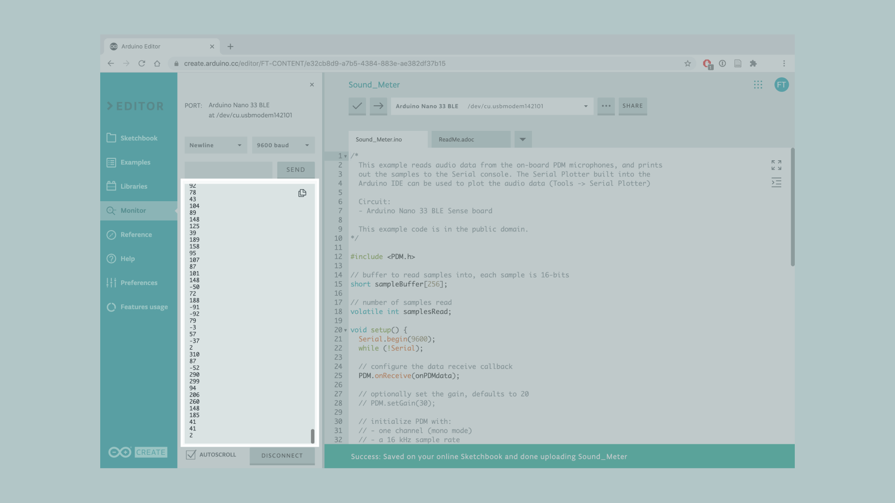

If you want to test it, the only thing you need to do is to place the board next to a speaker and play some music to see how the colors of the RGB LED change based on the music.

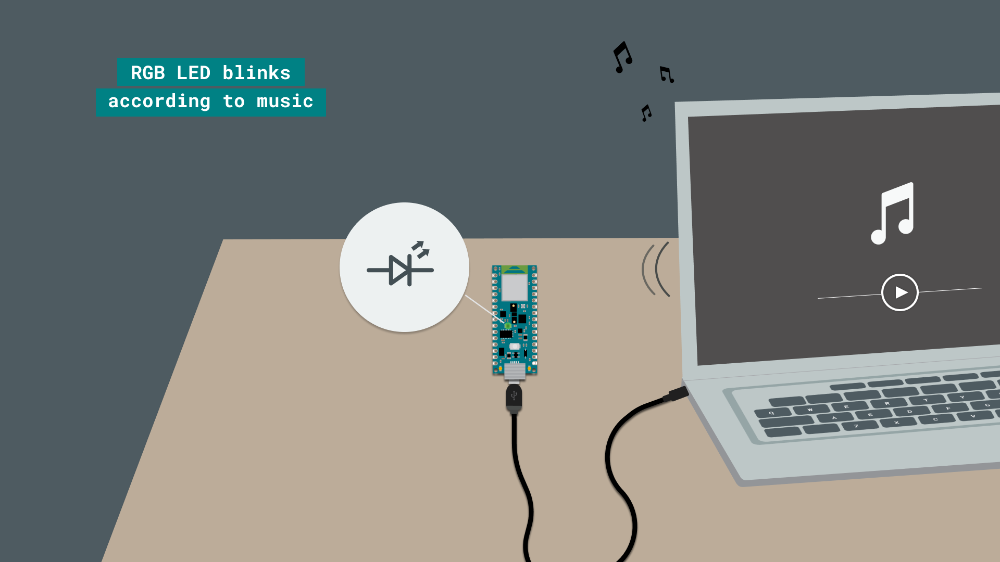

**Warning:** Remember that depending of the music, lights might blink too fast. **Immediately stop playing and consult a doctor if you experience any symptoms of “photosensitive epileptic seizures”.**


## Support

If you encounter any issues or have questions while working with your Nano 33 BLE Sense board, we provide various support resources to help you find answers and solutions.

### Help Center

Explore our Help Center, which offers a comprehensive collection of articles and guides for Nano family boards. The Help Center is designed to provide in-depth technical assistance and help you make the most of your device.

- [Nano family help center page](https://support.arduino.cc/hc/en-us/sections/360004605400-Nano-Family)

### Forum

Join our community forum to connect with other Nano family board users, share your experiences, and ask questions. The Forum is an excellent place to learn from others, discuss issues, and discover new ideas and projects related to the Nano 33 BLE Sense.

- [Nano category in the Arduino Forum](https://forum.arduino.cc/c/official-hardware/nano-family/87)

### Contact Us

Please get in touch with our support team if you need personalized assistance or have questions not covered by the help and support resources described before. We're happy to help you with any issues or inquiries about the Nano family boards.

- [Contact us page](https://www.arduino.cc/en/contact-us/)